<!-- NAV:START -->
> 📍 **README**

<details>
<summary>🗺️ Documentation Map</summary>

- 📂 **README** ← *you are here*
- 📚 **docs/**
  - [🏗️ Architecture_Overview](docs/Architecture_Overview.md)
  - [🔍 Audit_Guide](docs/Audit_Guide.md)
  - [⚙️ Canonical_Workflow](docs/Canonical_Workflow.md)
  - [💻 CLI_Reference](docs/CLI_Reference.md)
  - 📁 **cli/**
    - [📋 CLI_MIGRATION_MATRIX](docs/cli/CLI_MIGRATION_MATRIX.md)
    - [🌳 COMMAND_TREE](docs/cli/COMMAND_TREE.md)
  - [📝 CLI_Reorganization_Update_Report](docs/CLI_Reorganization_Update_Report.md)
  - [🔧 Experiment_Helpers](docs/Experiment_Helpers.md)
  - [⚙️ Experiment_Runs_Benchmark_Contract_Workflow](docs/Experiment_Runs_Benchmark_Contract_Workflow.md)
  - [⚙️ Experiment_Runs_Classical_Workflow](docs/Experiment_Runs_Classical_Workflow.md)
  - [⚙️ Experiment_Runs_DL_Workflow](docs/Experiment_Runs_DL_Workflow.md)
  - [📖 Introduction](docs/Introduction.md)
  - [💻 Migration_Guide_CLI_First_Temporal](docs/Migration_Guide_CLI_First_Temporal.md)
  - [🏷️ Operational_Labels](docs/Operational_Labels.md)
  - [💻 ST_Experiment_CLI_Documentation_Update_Report](docs/ST_Experiment_CLI_Documentation_Update_Report.md)
  - [💻 ST_Experiment_CLI_Philosophy](docs/ST_Experiment_CLI_Philosophy.md)
  - [💻 Study_CLI](docs/Study_CLI.md)
  - [💻 Temporal_Experiment_CLI_Philosophy](docs/Temporal_Experiment_CLI_Philosophy.md)
  - [💻 Temporal_Experiment_CLI_Reference](docs/Temporal_Experiment_CLI_Reference.md)
  - [📝 Temporal_Experiment_Orchestration_Update_Report](docs/Temporal_Experiment_Orchestration_Update_Report.md)
  - [⚙️ Thesis_Workflow](docs/Thesis_Workflow.md)
  - 🤖 **algorithm_design/**
    - [📂 README](docs/algorithm_design/README.md)
    - [📝 arma_imputer](docs/algorithm_design/arma_imputer.md)
    - [🔍 audit_details](docs/algorithm_design/audit_details.md)
    - [📋 regeneration_checklist](docs/algorithm_design/regeneration_checklist.md)
    - 👁️ **supervisor/**
      - [📂 README](docs/algorithm_design/supervisor/README.md)
      - [🏗️ overview](docs/algorithm_design/supervisor/overview.md)
      - [🤖 saits_lc_lch_rationale](docs/algorithm_design/supervisor/saits_lc_lch_rationale.md)
      - [📝 summary_table](docs/algorithm_design/supervisor/summary_table.md)
  - 🛠️ **assets/**
    - 🛠️ **utils/**
      - [📝 Procedure_Standard_GitHub_Connector](docs/assets/utils/Procedure_Standard_GitHub_Connector.md)
      - 🔬 **experiments/**
        - [📂 README](docs/assets/utils/experiments/README.md)
        - [🤖 CLI_LIFECYCLE_SMOKE](docs/assets/utils/experiments/CLI_LIFECYCLE_SMOKE.md)
        - [💻 CLI_PREPARATION_GUIDE](docs/assets/utils/experiments/CLI_PREPARATION_GUIDE.md)
        - [📊 COMPARISON_READINESS](docs/assets/utils/experiments/COMPARISON_READINESS.md)
        - [📝 INDEX](docs/assets/utils/experiments/INDEX.md)
        - [📝 NAMING_CONVENTIONS](docs/assets/utils/experiments/NAMING_CONVENTIONS.md)
        - [⚙️ OFFICIAL_PREPARATION_WORKFLOW](docs/assets/utils/experiments/OFFICIAL_PREPARATION_WORKFLOW.md)
        - 📁 **evidence/**
          - [📝 ARTIFACT_REQUIREMENTS](docs/assets/utils/experiments/evidence/ARTIFACT_REQUIREMENTS.md)
          - [🔍 EVIDENCE_REQUIREMENTS](docs/assets/utils/experiments/evidence/EVIDENCE_REQUIREMENTS.md)
          - [🔍 THESIS_EVIDENCE_MAP](docs/assets/utils/experiments/evidence/THESIS_EVIDENCE_MAP.md)
          - [🔍 TRAINING_SELECTION_EVIDENCE](docs/assets/utils/experiments/evidence/TRAINING_SELECTION_EVIDENCE.md)
        - 🔬 **future_lanes/**
          - [📂 README](docs/assets/utils/experiments/future_lanes/README.md)
          - [📝 SPATIOTEMPORAL_EXTENSION_PLACEHOLDER](docs/assets/utils/experiments/future_lanes/SPATIOTEMPORAL_EXTENSION_PLACEHOLDER.md)
          - [📝 TEMPORAL_CLASSICAL_BASELINES_PLACEHOLDER](docs/assets/utils/experiments/future_lanes/TEMPORAL_CLASSICAL_BASELINES_PLACEHOLDER.md)
          - [📝 TEMPORAL_DL_ABLATIONS_PLACEHOLDER](docs/assets/utils/experiments/future_lanes/TEMPORAL_DL_ABLATIONS_PLACEHOLDER.md)
        - 🔬 **lane1_temporal_londonaq/**
          - [📂 README](docs/assets/utils/experiments/lane1_temporal_londonaq/README.md)
          - [💻 CLI_RUNBOOK](docs/assets/utils/experiments/lane1_temporal_londonaq/CLI_RUNBOOK.md)
          - [📊 COMPARISON_PLAN](docs/assets/utils/experiments/lane1_temporal_londonaq/COMPARISON_PLAN.md)
          - [📝 DL_Benchmark_LondonAQ_MAR](docs/assets/utils/experiments/lane1_temporal_londonaq/DL_Benchmark_LondonAQ_MAR.md)
          - [📝 DL_Benchmark_LondonAQ_MCAR](docs/assets/utils/experiments/lane1_temporal_londonaq/DL_Benchmark_LondonAQ_MCAR.md)
          - [📝 DL_Benchmark_LondonAQ_MNAR](docs/assets/utils/experiments/lane1_temporal_londonaq/DL_Benchmark_LondonAQ_MNAR.md)
          - [⚙️ EXECUTION_ORDER](docs/assets/utils/experiments/lane1_temporal_londonaq/EXECUTION_ORDER.md)
          - [📝 EXPECTED_OBJECTS](docs/assets/utils/experiments/lane1_temporal_londonaq/EXPECTED_OBJECTS.md)
          - [📝 EXPORT_AND_REPORTING_NOTES](docs/assets/utils/experiments/lane1_temporal_londonaq/EXPORT_AND_REPORTING_NOTES.md)
          - [📝 OFFICIAL_DL_BENCHMARK_GRID](docs/assets/utils/experiments/lane1_temporal_londonaq/OFFICIAL_DL_BENCHMARK_GRID.md)
          - [📋 PREPARATION_CHECKLIST](docs/assets/utils/experiments/lane1_temporal_londonaq/PREPARATION_CHECKLIST.md)
          - [📝 TEMPORAL_EXPERIMENT_LANE](docs/assets/utils/experiments/lane1_temporal_londonaq/TEMPORAL_EXPERIMENT_LANE.md)
        - 🔬 **lane1_temporal_londonaq_classical/**
          - [📂 README](docs/assets/utils/experiments/lane1_temporal_londonaq_classical/README.md)
          - [📊 COMPARISON_PLAN](docs/assets/utils/experiments/lane1_temporal_londonaq_classical/COMPARISON_PLAN.md)
          - [⚙️ EXECUTION_ORDER](docs/assets/utils/experiments/lane1_temporal_londonaq_classical/EXECUTION_ORDER.md)
          - [📝 OFFICIAL_CLASSICAL_BENCHMARK_GRID](docs/assets/utils/experiments/lane1_temporal_londonaq_classical/OFFICIAL_CLASSICAL_BENCHMARK_GRID.md)
        - 🔬 **lane2_spatiotemporal_londonaq/**
          - [📂 README](docs/assets/utils/experiments/lane2_spatiotemporal_londonaq/README.md)
          - [🤖 ALGORITHM_IMPLEMENTATION_AUDIT](docs/assets/utils/experiments/lane2_spatiotemporal_londonaq/ALGORITHM_IMPLEMENTATION_AUDIT.md)
          - [📊 EXECUTION_AND_COMPARISON_PLAN](docs/assets/utils/experiments/lane2_spatiotemporal_londonaq/EXECUTION_AND_COMPARISON_PLAN.md)
          - [📝 EXPECTED_OBJECTS](docs/assets/utils/experiments/lane2_spatiotemporal_londonaq/EXPECTED_OBJECTS.md)
          - [📝 GRAPH_CONSTRUCTION_POLICY](docs/assets/utils/experiments/lane2_spatiotemporal_londonaq/GRAPH_CONSTRUCTION_POLICY.md)
          - [📝 INDEX_UPDATE_SNIPPET](docs/assets/utils/experiments/lane2_spatiotemporal_londonaq/INDEX_UPDATE_SNIPPET.md)
          - [📝 MODEL_SELECTION_RATIONALE](docs/assets/utils/experiments/lane2_spatiotemporal_londonaq/MODEL_SELECTION_RATIONALE.md)
          - [📝 OFFICIAL_ST_BENCHMARK_GRID](docs/assets/utils/experiments/lane2_spatiotemporal_londonaq/OFFICIAL_ST_BENCHMARK_GRID.md)
          - [📋 PREPARATION_CHECKLIST](docs/assets/utils/experiments/lane2_spatiotemporal_londonaq/PREPARATION_CHECKLIST.md)
          - [💻 REFERENCES](docs/assets/utils/experiments/lane2_spatiotemporal_londonaq/REFERENCES.md)
          - [📉 SPATIAL_MISSINGNESS_PROTOCOL](docs/assets/utils/experiments/lane2_spatiotemporal_londonaq/SPATIAL_MISSINGNESS_PROTOCOL.md)
          - [💻 ST_LANE_CLI_RUNBOOK](docs/assets/utils/experiments/lane2_spatiotemporal_londonaq/ST_LANE_CLI_RUNBOOK.md)
          - 📁 **recipes/**
            - [📂 README](docs/assets/utils/experiments/lane2_spatiotemporal_londonaq/recipes/README.md)
      - 📁 **studies/**
        - [📂 README](docs/assets/utils/studies/README.md)
  - 🧪 **dev/**
    - [📝 Object_Hierarchy_Map](docs/dev/Object_Hierarchy_Map.md)
    - 🏗️ **architecture_rebase/**
      - [📝 FT00_LEGACY_EXCEPTIONS](docs/dev/architecture_rebase/FT00_LEGACY_EXCEPTIONS.md)
      - [💻 FT04_COMMAND_PARITY_MATRIX](docs/dev/architecture_rebase/FT04_COMMAND_PARITY_MATRIX.md)
      - 🤖 **algorithm_design/**
        - [📝 lab_start](docs/dev/architecture_rebase/algorithm_design/lab_start.md)
    - 🧪 **diagnostic/**
      - [🔍 AUDIT_training_diagnosis_summary](docs/dev/diagnostic/AUDIT_training_diagnosis_summary.md)
      - 📁 **data/**
        - [🧪 training_diagnosis_summary](docs/dev/diagnostic/data/training_diagnosis_summary.md)
      - 🖼️ **figures/**
        - [🧪 TRAINING_GUIDE](docs/dev/diagnostic/figures/TRAINING_GUIDE.md)
  - 📄 **exports/**
    - 📄 **thesis/**
      - 📄 **chapter04/**
        - [📂 README](docs/exports/thesis/chapter04/README.md)
        - 🔍 **00_audit_snapshot/**
          - [🤖 ad0_design_inventory](docs/exports/thesis/chapter04/00_audit_snapshot/ad0_design_inventory.md)
          - [🤖 ad15_conformance](docs/exports/thesis/chapter04/00_audit_snapshot/ad15_conformance.md)
          - [🤖 ad1_algorithm_cards](docs/exports/thesis/chapter04/00_audit_snapshot/ad1_algorithm_cards.md)
          - [⚙️ ad2_execution_truth](docs/exports/thesis/chapter04/00_audit_snapshot/ad2_execution_truth.md)
          - [📝 lc1_masking_truth](docs/exports/thesis/chapter04/00_audit_snapshot/lc1_masking_truth.md)
        - 📉 **01_dataset_characterization/**
          - 🖼️ **figures/**
            - [📉 DATASET_GUIDE](docs/exports/thesis/chapter04/01_dataset_characterization/figures/DATASET_GUIDE.md)
        - 📉 **02_missingness_characterization/**
          - 🖼️ **figures/**
            - [📋 MISSNESS_GUIDE](docs/exports/thesis/chapter04/02_missingness_characterization/figures/MISSNESS_GUIDE.md)
        - 🤖 **03_algorithm_lifecycle/**
          - [🤖 DL_LIFECYCLE_NARRATIVE(Diagnostic)](docs/exports/thesis/chapter04/03_algorithm_lifecycle/DL_LIFECYCLE_NARRATIVE(Diagnostic).md)
          - 🖼️ **figures/**
            - [🧪 TRAINING_GUIDE](docs/exports/thesis/chapter04/03_algorithm_lifecycle/figures/TRAINING_GUIDE.md)
          - 📎 **sidecars/**
            - [🧪 training_diagnosis_summary](docs/exports/thesis/chapter04/03_algorithm_lifecycle/sidecars/training_diagnosis_summary.md)
          - 📊 **tables/**
            - [🤖 algorithm_evidence_status_table](docs/exports/thesis/chapter04/03_algorithm_lifecycle/tables/algorithm_evidence_status_table.md)
            - [🧪 diagnostic_only_explanation](docs/exports/thesis/chapter04/03_algorithm_lifecycle/tables/diagnostic_only_explanation.md)
        - 📊 **04_comparisons/**
          - [📂 README](docs/exports/thesis/chapter04/04_comparisons/README.md)
          - 📁 **baselines/**
            - [📂 README](docs/exports/thesis/chapter04/04_comparisons/baselines/README.md)
            - 🖼️ **figures/**
              - [📊 COMPARISON_GUIDE](docs/exports/thesis/chapter04/04_comparisons/baselines/figures/COMPARISON_GUIDE.md)
          - 📁 **baselines_and_dl/**
            - [📂 README](docs/exports/thesis/chapter04/04_comparisons/baselines_and_dl/README.md)
            - 🖼️ **figures/**
              - [📊 COMPARISON_GUIDE](docs/exports/thesis/chapter04/04_comparisons/baselines_and_dl/figures/COMPARISON_GUIDE.md)
          - 📁 **dl_temporal/**
            - [📂 README](docs/exports/thesis/chapter04/04_comparisons/dl_temporal/README.md)
            - 🖼️ **figures/**
              - [📊 COMPARISON_GUIDE](docs/exports/thesis/chapter04/04_comparisons/dl_temporal/figures/COMPARISON_GUIDE.md)
          - 🖼️ **figures/**
            - [📊 COMPARISON_GUIDE](docs/exports/thesis/chapter04/04_comparisons/figures/COMPARISON_GUIDE.md)
      - 📄 **chapter06/**
        - [📂 README](docs/exports/thesis/chapter06/README.md)
        - 📁 **00_st_recipe_book/**
          - [📊 ST_RECIPE_BOOK_READINESS](docs/exports/thesis/chapter06/00_st_recipe_book/ST_RECIPE_BOOK_READINESS.md)
          - [📝 ST_RECIPE_MATERIALIZATION_REPORT](docs/exports/thesis/chapter06/00_st_recipe_book/ST_RECIPE_MATERIALIZATION_REPORT.md)
          - [📝 ST_RUN00_PHASE_A_FIX01_BLOCKER_CLOSURE_REPORT](docs/exports/thesis/chapter06/00_st_recipe_book/ST_RUN00_PHASE_A_FIX01_BLOCKER_CLOSURE_REPORT.md)
          - [📝 ST_RUN00_PHASE_A_PREFLIGHT_REPORT](docs/exports/thesis/chapter06/00_st_recipe_book/ST_RUN00_PHASE_A_PREFLIGHT_REPORT.md)
          - [📝 ST_RUN00_PHASE_B_CALIBRATION_REPORT](docs/exports/thesis/chapter06/00_st_recipe_book/ST_RUN00_PHASE_B_CALIBRATION_REPORT.md)
          - [🔍 ST_RUN00_PHASE_B_FIX01_EVIDENCE_CLOSURE_REPORT](docs/exports/thesis/chapter06/00_st_recipe_book/ST_RUN00_PHASE_B_FIX01_EVIDENCE_CLOSURE_REPORT.md)
          - [📝 ST_RUN00_PHASE_B_FIX02_VALIDATION_CONVERGENCE_CLOSURE_REPORT](docs/exports/thesis/chapter06/00_st_recipe_book/ST_RUN00_PHASE_B_FIX02_VALIDATION_CONVERGENCE_CLOSURE_REPORT.md)
          - [⚙️ ST_RUN00_PHASE_C_FIX01_CANONICAL_REPORT_ALIGNMENT](docs/exports/thesis/chapter06/00_st_recipe_book/ST_RUN00_PHASE_C_FIX01_CANONICAL_REPORT_ALIGNMENT.md)
          - [🔍 ST_RUN00_PHASE_C_FIX02_OFFICIAL_CAMPAIGN_STATUS_SEMANTICS](docs/exports/thesis/chapter06/00_st_recipe_book/ST_RUN00_PHASE_C_FIX02_OFFICIAL_CAMPAIGN_STATUS_SEMANTICS.md)
          - [📋 ST_RUN00_PHASE_C_LAUNCH_PREPARATION_REPORT](docs/exports/thesis/chapter06/00_st_recipe_book/ST_RUN00_PHASE_C_LAUNCH_PREPARATION_REPORT.md)
          - [📝 ST_RUN00_PHASE_C_TIER_A_OFFICIAL_REPORT](docs/exports/thesis/chapter06/00_st_recipe_book/ST_RUN00_PHASE_C_TIER_A_OFFICIAL_REPORT.md)
        - 📁 **01_graph_characterization/**
          - [📝 adjacency_summary_table](docs/exports/thesis/chapter06/01_graph_characterization/adjacency_summary_table.md)
          - [📝 graph_policy_table](docs/exports/thesis/chapter06/01_graph_characterization/graph_policy_table.md)
          - [📝 node_mapping_table](docs/exports/thesis/chapter06/01_graph_characterization/node_mapping_table.md)
        - 📉 **02_spatial_missingness_characterization/**
          - [📝 mask_bank_summary_table](docs/exports/thesis/chapter06/02_spatial_missingness_characterization/mask_bank_summary_table.md)
          - [📉 spatial_missingness_mechanism_table](docs/exports/thesis/chapter06/02_spatial_missingness_characterization/spatial_missingness_mechanism_table.md)
          - [📝 target_vs_realized_table](docs/exports/thesis/chapter06/02_spatial_missingness_characterization/target_vs_realized_table.md)
        - 🤖 **03_st_algorithm_lifecycle/**
          - [🤖 algorithm_card_summary](docs/exports/thesis/chapter06/03_st_algorithm_lifecycle/algorithm_card_summary.md)
          - [🤖 st_algorithm_lifecycle_summary](docs/exports/thesis/chapter06/03_st_algorithm_lifecycle/st_algorithm_lifecycle_summary.md)
        - 📊 **04_st_comparisons/**
          - [📝 graph_policy_sensitivity_table](docs/exports/thesis/chapter06/04_st_comparisons/graph_policy_sensitivity_table.md)
          - [📊 spatial_stress_comparison](docs/exports/thesis/chapter06/04_st_comparisons/spatial_stress_comparison.md)
          - [📝 temporal_vs_st_aligned_support_table](docs/exports/thesis/chapter06/04_st_comparisons/temporal_vs_st_aligned_support_table.md)
          - [📝 within_st_all_valid_groups_ranking](docs/exports/thesis/chapter06/04_st_comparisons/within_st_all_valid_groups_ranking.md)
          - [📝 within_st_tier_a_grid4n_ranking](docs/exports/thesis/chapter06/04_st_comparisons/within_st_tier_a_grid4n_ranking.md)
        - 📁 **06_st_gates/**
          - [🤖 algorithm_card_readiness_report](docs/exports/thesis/chapter06/06_st_gates/algorithm_card_readiness_report.md)
          - [📝 artifact_completeness_report](docs/exports/thesis/chapter06/06_st_gates/artifact_completeness_report.md)
          - [📝 convergence_report](docs/exports/thesis/chapter06/06_st_gates/convergence_report.md)
          - [📊 gate_report_comparison_ready](docs/exports/thesis/chapter06/06_st_gates/gate_report_comparison_ready.md)
          - [🧪 gate_report_scientific_training_ready](docs/exports/thesis/chapter06/06_st_gates/gate_report_scientific_training_ready.md)
          - [📄 gate_report_thesis_ready](docs/exports/thesis/chapter06/06_st_gates/gate_report_thesis_ready.md)
          - [📝 gate_report_train_only_correlation_graph_ready](docs/exports/thesis/chapter06/06_st_gates/gate_report_train_only_correlation_graph_ready.md)
          - [🔍 scientific_evidence_export_ready_report](docs/exports/thesis/chapter06/06_st_gates/scientific_evidence_export_ready_report.md)
          - [📝 train_only_correlation_graph_report](docs/exports/thesis/chapter06/06_st_gates/train_only_correlation_graph_report.md)
          - [🧪 training_adequacy_report](docs/exports/thesis/chapter06/06_st_gates/training_adequacy_report.md)
        - 🖼️ **07_figures/**
          - [📂 README](docs/exports/thesis/chapter06/07_figures/README.md)
          - 📁 **A_training_dynamics/**
            - [📂 README](docs/exports/thesis/chapter06/07_figures/A_training_dynamics/README.md)
          - 📁 **B_performance_distribution/**
            - [📂 README](docs/exports/thesis/chapter06/07_figures/B_performance_distribution/README.md)
          - 📁 **C_realization_stability/**
            - [📂 README](docs/exports/thesis/chapter06/07_figures/C_realization_stability/README.md)
          - 📁 **D_runtime_efficiency/**
            - [📂 README](docs/exports/thesis/chapter06/07_figures/D_runtime_efficiency/README.md)
          - 📁 **E_scientific_evidence/**
            - [📂 README](docs/exports/thesis/chapter06/07_figures/E_scientific_evidence/README.md)
        - 📁 **07_graph_policy_sensitivity/**
          - [📂 README](docs/exports/thesis/chapter06/07_graph_policy_sensitivity/README.md)
          - [📝 GRAPH_POLICY_SENSITIVITY_BLOCKERS](docs/exports/thesis/chapter06/07_graph_policy_sensitivity/GRAPH_POLICY_SENSITIVITY_BLOCKERS.md)
          - [📝 GRAPH_POLICY_SENSITIVITY_REPORT](docs/exports/thesis/chapter06/07_graph_policy_sensitivity/GRAPH_POLICY_SENSITIVITY_REPORT.md)
        - 📁 **08_scientific_evidence_profile/**
          - [📂 README](docs/exports/thesis/chapter06/08_scientific_evidence_profile/README.md)
          - [📝 SCIENTIFIC_BLOCKERS](docs/exports/thesis/chapter06/08_scientific_evidence_profile/SCIENTIFIC_BLOCKERS.md)
          - [📝 SCIENTIFIC_CLAIM_MATRIX](docs/exports/thesis/chapter06/08_scientific_evidence_profile/SCIENTIFIC_CLAIM_MATRIX.md)
          - [🔍 SCIENTIFIC_EVIDENCE_PROFILE](docs/exports/thesis/chapter06/08_scientific_evidence_profile/SCIENTIFIC_EVIDENCE_PROFILE.md)
        - 📁 **09_scientific_gate/**
          - [📂 README](docs/exports/thesis/chapter06/09_scientific_gate/README.md)
          - [📝 SCIENTIFIC_GATE_BLOCKERS](docs/exports/thesis/chapter06/09_scientific_gate/SCIENTIFIC_GATE_BLOCKERS.md)
          - [📝 SCIENTIFIC_GATE_REPORT](docs/exports/thesis/chapter06/09_scientific_gate/SCIENTIFIC_GATE_REPORT.md)

</details>
<!-- NAV:END -->

<p align="center">
  <br>
  
  <br><br>
  <strong>Evidence-centered research platform for reproducible machine-learning experimentation.</strong>
  <br><br>
  <em>Design experiments, run benchmarks, inspect results, and keep the evidence readable.</em>
</p>

<br>

---

## What is EviBench?

**EviBench** is a research-oriented platform for building reproducible machine-learning experiments.  
It is designed around one core principle:

> An experiment is not only a score. It is a chain of evidence.

EviBench keeps datasets, algorithms, benchmark contracts, runs, metrics, artifacts, comparisons, and exportable evidence connected in one workflow. The platform is organized as domain-specific modules. The first production module is **ImputeBench**, focused on missing-data imputation for temporal, spatial, and air-quality datasets.

---

## ImputeBench — Missing-data imputation workbench

**ImputeBench** supports imputation experiments from preparation to evidence export.

It helps users:

- register datasets and imputation algorithms;
- create masking protocols and benchmark contracts;
- execute classical and deep-learning imputation runs;
- inspect result artifacts, metrics, runtime traces, and training evidence;
- compare compatible methods under shared benchmark conditions;
- export figures, tables, storyboards, and evidence bundles for research reporting.

The recommended route is:


Start here:

- [`docs/Introduction.md`](docs/Introduction.md)
- [`docs/Canonical_Workflow.md`](docs/Canonical_Workflow.md)
- [`docs/Experiment_Runs_DL_Workflow.md`](docs/Experiment_Runs_DL_Workflow.md)
- [`docs/Thesis_Workflow.md`](docs/Thesis_Workflow.md)

---

## Quick start teaser

> This public repository exposes documentation and selected evidence exports.  
> The full application source is maintained in the private development repository.

A typical ImputeBench evidence-export workflow looks like this:

```bash
# Generate dataset characterization evidence
imputebench thesis dataset

# Generate missingness protocol evidence
imputebench thesis missingness

# Generate DL training lifecycle evidence (diagnostic lane — MCAR 30%)
imputebench thesis training --diagnostic-only

# Export intra-diagnostic comparison artifacts
python scripts/export_chapter04_official_comparisons.py --diagnostic-only

# Generate comparison evidence by lot (classical runs)
imputebench thesis compare --lot baselines
imputebench thesis compare --lot dl_temporal
imputebench thesis compare --lot baselines_and_dl
```

### CLI Architecture

As of v0.2.0, the CLI is organized into **8 canonical domains**:

```text
imputebench
├── data          # Dataset, ingest, masking, calibration
├── methods       # Algorithm, plugin
├── experiment    # Run, st (15 modules), temporal (13 modules)
├── results       # Result, inspect, compare, evidence, gate, view
├── study         # Study management
├── thesis        # Thesis evidence export
├── admin         # Paths, audit, config, maintenance, env
└── lab           # Interactive lab launcher
```

All legacy flat-root commands (`imputebench dataset`, `imputebench algorithm`, etc.) remain functional as hidden aliases with deprecation warnings. See [`docs/cli/CLI_MIGRATION_MATRIX.md`](docs/cli/CLI_MIGRATION_MATRIX.md) and [`docs/CLI_Reorganization_Update_Report.md`](docs/CLI_Reorganization_Update_Report.md).

---

The current evidence pack is organized under:

```text
docs/exports/thesis/chapter04/
├── 00_audit_snapshot/
├── 01_dataset_characterization/
├── 02_missingness_characterization/
├── 03_algorithm_lifecycle/
├── 04_comparisons/
├── 05_storyboards/
├── 06_gates/
└── 07_ui_screenshots/
```

Open the evidence hub:

- [`docs/exports/thesis/chapter04/README.md`](docs/exports/thesis/chapter04/README.md)

---

## Featured use case — Air-quality imputation benchmark

The current public evidence pack demonstrates an end-to-end imputation benchmark on a synthetic urban air-quality dataset.

The use case follows a controlled evaluation workflow:

```text
Dataset characterization
→ Missingness protocol design
→ Classical and deep-learning runs
→ Training lifecycle inspection
→ Baseline vs DL comparison
→ Storyboard and gate checks
→ Evidence export
```

The objective is not only to rank algorithms. The objective is to make the comparison auditable:

- What dataset was used?
- What masking mechanisms were evaluated?
- Which algorithms were compared?
- Were benchmark contracts and mask banks aligned?
- Which figures support each interpretation?
- Which caveats limit the claims?

---

## Evidence gallery

### Dataset characterization

Dataset figures describe the benchmark before masking or imputation.

<p align="center">
  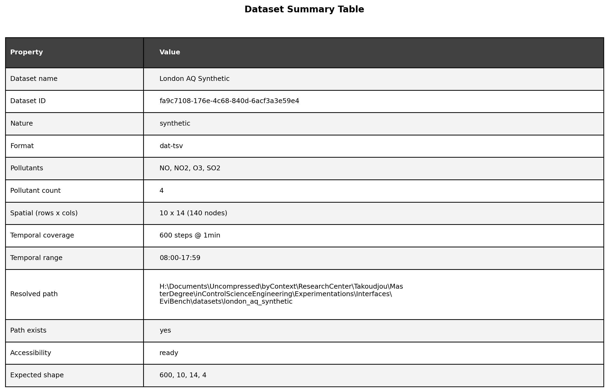
</p>

<p align="center">
  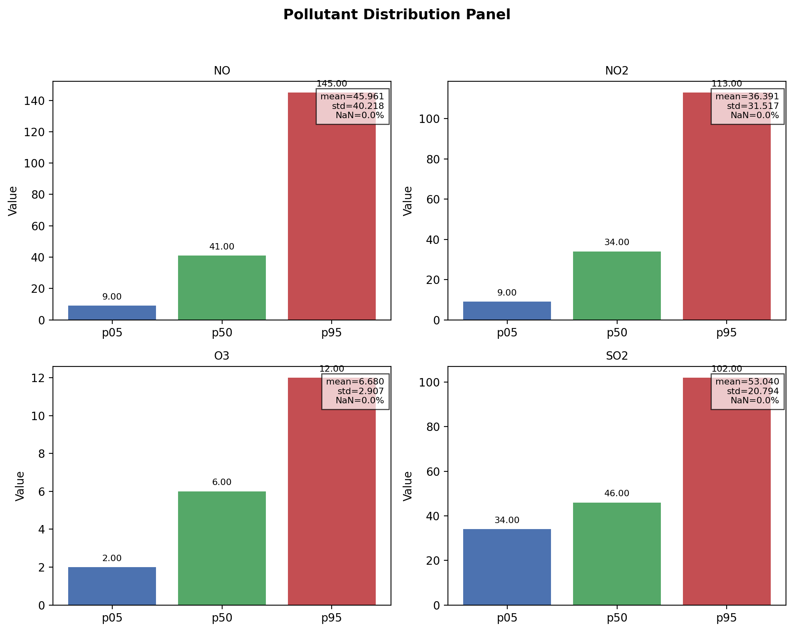
</p>

Key links:

- [`DATASET_GUIDE.md`](docs/exports/thesis/chapter04/01_dataset_characterization/figures/DATASET_GUIDE.md)
- [`01_dataset_characterization/figures/`](docs/exports/thesis/chapter04/01_dataset_characterization/figures/)
- [`01_dataset_characterization/sidecars/`](docs/exports/thesis/chapter04/01_dataset_characterization/sidecars/)

---

### Missingness characterization

Missingness figures document the artificial masking protocol and its realized behavior.

<p align="center">
  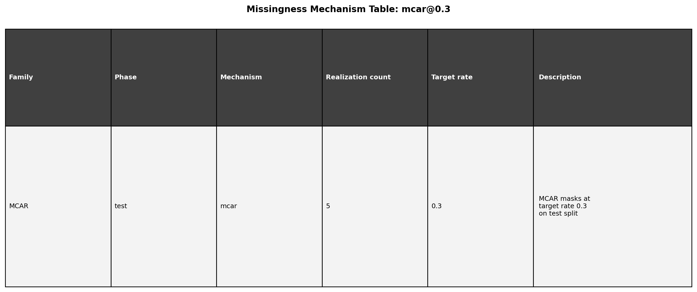
</p>

<p align="center">
  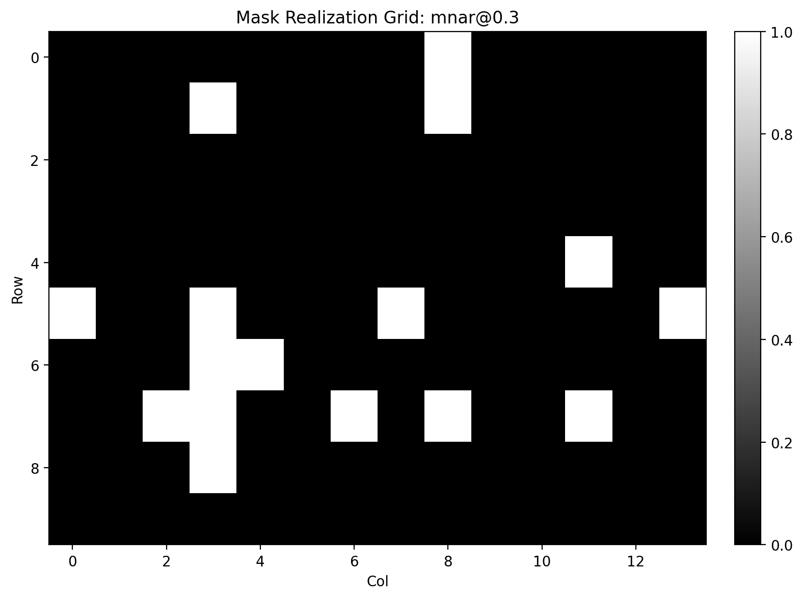
</p>

Key links:

- [`MISSNESS_GUIDE.md`](docs/exports/thesis/chapter04/02_missingness_characterization/figures/MISSNESS_GUIDE.md)
- [`02_missingness_characterization/figures/`](docs/exports/thesis/chapter04/02_missingness_characterization/figures/)
- [`02_missingness_characterization/sidecars/`](docs/exports/thesis/chapter04/02_missingness_characterization/sidecars/)

---

### Deep-learning lifecycle evidence

A 32-plan diagnostic sweep (BRITS, SAITS, SAITS-LC, GRU-D × MCAR 30% × LondonAQ) established lifecycle conformance for all four DL algorithms. The full narrative is in [`CHAPTER04_DL_LIFECYCLE_NARRATIVE.md`](docs/exports/thesis/chapter04/03_algorithm_lifecycle/DL_LIFECYCLE_NARRATIVE(Diagnostic).md).

Intra-diagnostic RMSE ranking (best/mean/worst per algorithm):

<p align="center">
  
</p>

Training lifecycle figures:

<p align="center">
  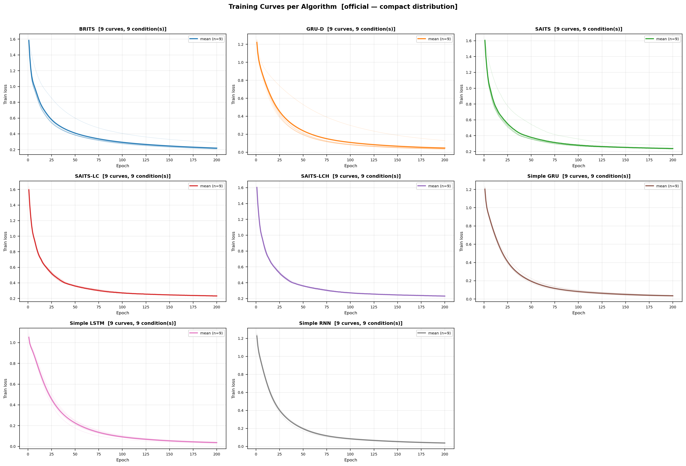
</p>

<p align="center">
  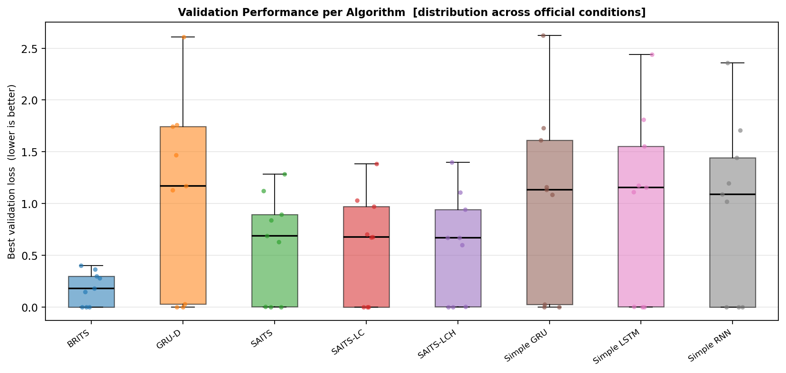
</p>

Key links:

- [`CHAPTER04_DL_LIFECYCLE_NARRATIVE.md`](docs/exports/thesis/chapter04/03_algorithm_lifecycle/DL_LIFECYCLE_NARRATIVE(Diagnostic).md) — 11-section lifecycle narrative
- `diagnostic_comparison_table.md` — RMSE/MAE stats by algorithm
- [`TRAINING_GUIDE.md`](docs/exports/thesis/chapter04/03_algorithm_lifecycle/figures/TRAINING_GUIDE.md)
- [`training_diagnosis_summary.md`](docs/exports/thesis/chapter04/03_algorithm_lifecycle/sidecars/training_diagnosis_summary.md)
- [`algorithm_evidence_status_table.md`](docs/exports/thesis/chapter04/03_algorithm_lifecycle/tables/algorithm_evidence_status_table.md)

---

### Comparison evidence

Comparison evidence is split into three lots so that intra-family and cross-family readings remain clear.

| Lot | Purpose | Entry point |
|---|---|---|
| `baselines` | Classical + naive baselines | [`04_comparisons/baselines/`](docs/exports/thesis/chapter04/04_comparisons/baselines/) |
| `dl_temporal` | Temporal deep-learning methods | [`04_comparisons/dl_temporal/`](docs/exports/thesis/chapter04/04_comparisons/dl_temporal/) |
| `baselines_and_dl` | Cross-family comparison | [`04_comparisons/baselines_and_dl/`](docs/exports/thesis/chapter04/04_comparisons/baselines_and_dl/) |

#### Baselines

<p align="center">
  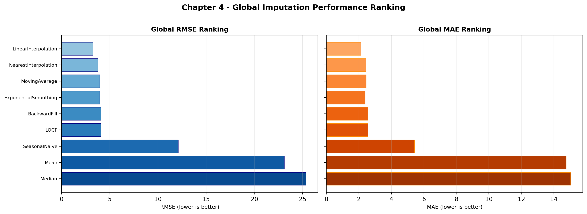
</p>

#### Temporal DL

<p align="center">
  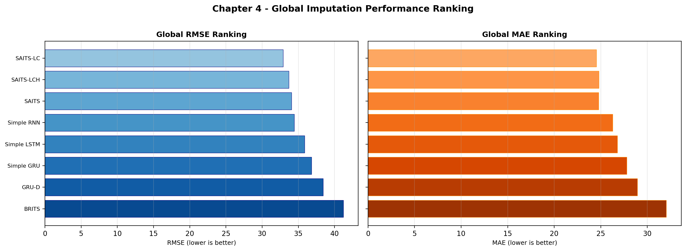
</p>

#### Baselines and DL

<p align="center">
  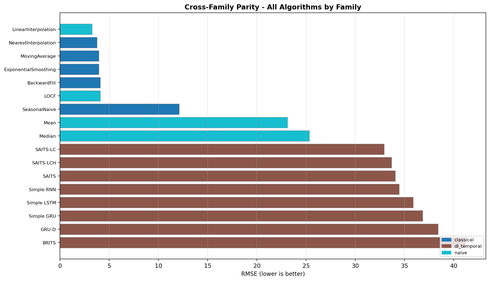
</p>

Key links:

- [`baselines/figures/COMPARISON_GUIDE.md`](docs/exports/thesis/chapter04/04_comparisons/baselines/figures/COMPARISON_GUIDE.md)
- [`dl_temporal/figures/COMPARISON_GUIDE.md`](docs/exports/thesis/chapter04/04_comparisons/dl_temporal/figures/COMPARISON_GUIDE.md)
- [`baselines_and_dl/figures/COMPARISON_GUIDE.md`](docs/exports/thesis/chapter04/04_comparisons/baselines_and_dl/figures/COMPARISON_GUIDE.md)
- [`04_comparisons/per_spec/`](docs/exports/thesis/chapter04/04_comparisons/per_spec/)

---

### Evidence gates and UI traceability

Gate reports and UI screenshots document the operational route used to build evidence.

<p align="center">
  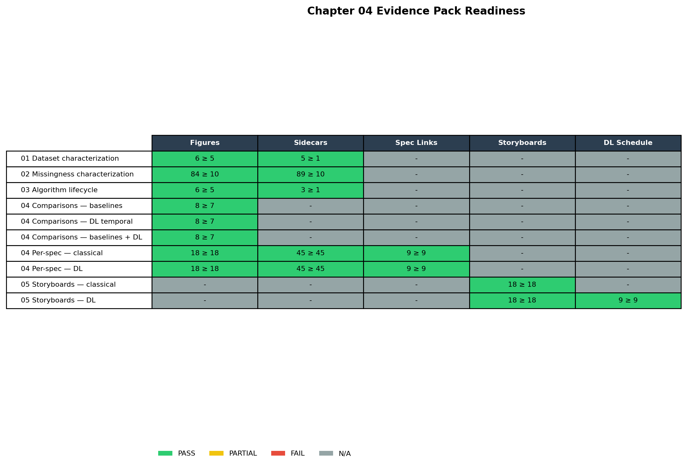
</p>

<p align="center">
  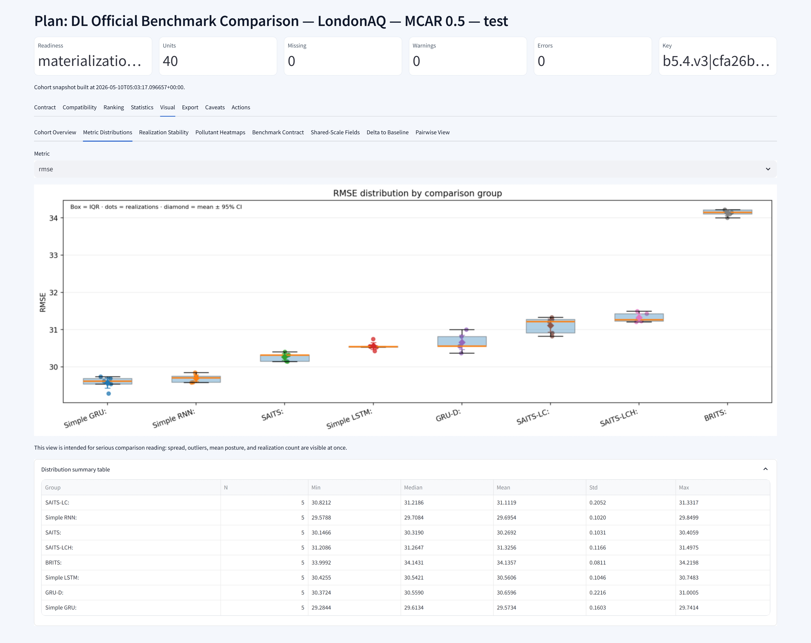
</p>

Key links:

- [`06_gates/`](docs/exports/thesis/chapter04/06_gates/)
- [`07_ui_screenshots/`](docs/exports/thesis/chapter04/07_ui_screenshots/)
- [`05_storyboards/`](docs/exports/thesis/chapter04/05_storyboards/)

---

## How to read the benchmark evidence

The benchmark evidence should be read conservatively.

Allowed interpretation:

> Under the tested benchmark contract, method X obtained lower MAE/RMSE than method Y for the evaluated missingness condition.

Not allowed:

> Method X is universally better.

Important caveat:

> Results are specific to the active dataset, masking protocols, model configurations, and benchmark contracts. They should not be generalized without additional datasets and validation settings.

---

## Documentation map

| Document | Purpose |
|---|---|
| [`docs/Introduction.md`](docs/Introduction.md) | Overview of EviBench and ImputeBench |
| [`docs/Canonical_Workflow.md`](docs/Canonical_Workflow.md) | Main app workflow |
| [`docs/Experiment_Runs_Classical_Workflow.md`](docs/Experiment_Runs_Classical_Workflow.md) | Classical workflow |
| [`docs/Experiment_Runs_DL_Workflow.md`](docs/Experiment_Runs_DL_Workflow.md) | Deep-learning workflow |
| [`docs/Experiment_Runs_Benchmark_Contract_Workflow.md`](docs/Experiment_Runs_Benchmark_Contract_Workflow.md) | Benchmark contract workflow |
| [`docs/Thesis_Workflow.md`](docs/Thesis_Workflow.md) | Dashboard → Storyboard → Gate → Export |
| [`docs/CLI_Reference.md`](docs/CLI_Reference.md) | CLI command reference |
| [`docs/cli/CLI_MIGRATION_MATRIX.md`](docs/cli/CLI_MIGRATION_MATRIX.md) | Legacy → canonical CLI path mapping |
| [`docs/CLI_Reorganization_Update_Report.md`](docs/CLI_Reorganization_Update_Report.md) | CLI reorganization closure metrics |
| [`docs/Architecture_Overview.md`](docs/Architecture_Overview.md) | Architecture and design invariants |
| [`docs/exports/thesis/chapter04/README.md`](docs/exports/thesis/chapter04/README.md) | Air-quality imputation evidence pack |

---

## Repository model

This repository is the **public documentation and evidence repository** for EviBench.

It contains:

```text
docs/        public documentation and exported evidence
datasets/    sample datasets
assets/      logos, images, utilities
LICENSE      license information
README.md    public landing page
```

The full source code and development workflows are maintained in the private development repository.

---

## Status

| Module | Domain | Status |
|---|---|---|
| **ImputeBench** | Missing-data imputation | Active |
| DataAnalysis | Data generation and analysis | Planned |
| SecuritySystem | Anomaly and intrusion detection | Planned |

---

## Citation and research context

EviBench is developed as a research platform for evidence-centered experimentation and reproducible benchmark reporting.

If you use EviBench documentation, workflows, or exported evidence patterns in your own research, please cite the project repository and the relevant documentation version.

---

<br>

<p align="center">
  
</p>

<!-- FOOTER:START -->

---

> ← *(first)* · [⬆ Top](#) · [🏠 Home](README.md) · [Architecture_Overview →](docs/Architecture_Overview.md)
<!-- FOOTER:END -->
