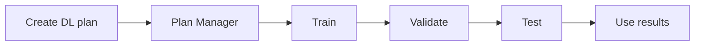

<!-- NAV:START -->
> [🏠 Home](../README.md) · 📍 **Experiment_Runs_DL_Workflow**

<details>
<summary>🗺️ Documentation Map</summary>

- [📂 README](../README.md)
- 📚 **docs/**
  - [🏗️ Architecture_Overview](Architecture_Overview.md)
  - [🔍 Audit_Guide](Audit_Guide.md)
  - [⚙️ Canonical_Workflow](Canonical_Workflow.md)
  - [💻 CLI_Reference](CLI_Reference.md)
  - [🔧 Experiment_Helpers](Experiment_Helpers.md)
  - [⚙️ Experiment_Runs_Benchmark_Contract_Workflow](Experiment_Runs_Benchmark_Contract_Workflow.md)
  - [⚙️ Experiment_Runs_Classical_Workflow](Experiment_Runs_Classical_Workflow.md)
  - ⚙️ **Experiment_Runs_DL_Workflow** ← *you are here*
  - [📖 Introduction](Introduction.md)
  - [💻 Migration_Guide_CLI_First_Temporal](Migration_Guide_CLI_First_Temporal.md)
  - [🏷️ Operational_Labels](Operational_Labels.md)
  - [💻 ST_Experiment_CLI_Documentation_Update_Report](ST_Experiment_CLI_Documentation_Update_Report.md)
  - [💻 ST_Experiment_CLI_Philosophy](ST_Experiment_CLI_Philosophy.md)
  - [💻 Study_CLI](Study_CLI.md)
  - [💻 Temporal_Experiment_CLI_Philosophy](Temporal_Experiment_CLI_Philosophy.md)
  - [💻 Temporal_Experiment_CLI_Reference](Temporal_Experiment_CLI_Reference.md)
  - [📝 Temporal_Experiment_Orchestration_Update_Report](Temporal_Experiment_Orchestration_Update_Report.md)
  - [⚙️ Thesis_Workflow](Thesis_Workflow.md)
  - 🤖 **algorithm_design/**
    - [📂 README](algorithm_design/README.md)
    - [📝 arma_imputer](algorithm_design/arma_imputer.md)
    - [🔍 audit_details](algorithm_design/audit_details.md)
    - [📋 regeneration_checklist](algorithm_design/regeneration_checklist.md)
    - 👁️ **supervisor/**
      - [📂 README](algorithm_design/supervisor/README.md)
      - [🏗️ overview](algorithm_design/supervisor/overview.md)
      - [🤖 saits_lc_lch_rationale](algorithm_design/supervisor/saits_lc_lch_rationale.md)
      - [📝 summary_table](algorithm_design/supervisor/summary_table.md)
  - 🛠️ **assets/**
    - 🛠️ **utils/**
      - [📝 Procedure_Standard_GitHub_Connector](assets/utils/Procedure_Standard_GitHub_Connector.md)
      - 🔬 **experiments/**
        - [📂 README](assets/utils/experiments/README.md)
        - [🤖 CLI_LIFECYCLE_SMOKE](assets/utils/experiments/CLI_LIFECYCLE_SMOKE.md)
        - [💻 CLI_PREPARATION_GUIDE](assets/utils/experiments/CLI_PREPARATION_GUIDE.md)
        - [📊 COMPARISON_READINESS](assets/utils/experiments/COMPARISON_READINESS.md)
        - [📝 INDEX](assets/utils/experiments/INDEX.md)
        - [📝 NAMING_CONVENTIONS](assets/utils/experiments/NAMING_CONVENTIONS.md)
        - [⚙️ OFFICIAL_PREPARATION_WORKFLOW](assets/utils/experiments/OFFICIAL_PREPARATION_WORKFLOW.md)
        - 📁 **evidence/**
          - [📝 ARTIFACT_REQUIREMENTS](assets/utils/experiments/evidence/ARTIFACT_REQUIREMENTS.md)
          - [🔍 EVIDENCE_REQUIREMENTS](assets/utils/experiments/evidence/EVIDENCE_REQUIREMENTS.md)
          - [🔍 THESIS_EVIDENCE_MAP](assets/utils/experiments/evidence/THESIS_EVIDENCE_MAP.md)
          - [🔍 TRAINING_SELECTION_EVIDENCE](assets/utils/experiments/evidence/TRAINING_SELECTION_EVIDENCE.md)
        - 🔬 **future_lanes/**
          - [📂 README](assets/utils/experiments/future_lanes/README.md)
          - [📝 SPATIOTEMPORAL_EXTENSION_PLACEHOLDER](assets/utils/experiments/future_lanes/SPATIOTEMPORAL_EXTENSION_PLACEHOLDER.md)
          - [📝 TEMPORAL_CLASSICAL_BASELINES_PLACEHOLDER](assets/utils/experiments/future_lanes/TEMPORAL_CLASSICAL_BASELINES_PLACEHOLDER.md)
          - [📝 TEMPORAL_DL_ABLATIONS_PLACEHOLDER](assets/utils/experiments/future_lanes/TEMPORAL_DL_ABLATIONS_PLACEHOLDER.md)
        - 🔬 **lane1_temporal_londonaq/**
          - [📂 README](assets/utils/experiments/lane1_temporal_londonaq/README.md)
          - [💻 CLI_RUNBOOK](assets/utils/experiments/lane1_temporal_londonaq/CLI_RUNBOOK.md)
          - [📊 COMPARISON_PLAN](assets/utils/experiments/lane1_temporal_londonaq/COMPARISON_PLAN.md)
          - [📝 DL_Benchmark_LondonAQ_MAR](assets/utils/experiments/lane1_temporal_londonaq/DL_Benchmark_LondonAQ_MAR.md)
          - [📝 DL_Benchmark_LondonAQ_MCAR](assets/utils/experiments/lane1_temporal_londonaq/DL_Benchmark_LondonAQ_MCAR.md)
          - [📝 DL_Benchmark_LondonAQ_MNAR](assets/utils/experiments/lane1_temporal_londonaq/DL_Benchmark_LondonAQ_MNAR.md)
          - [⚙️ EXECUTION_ORDER](assets/utils/experiments/lane1_temporal_londonaq/EXECUTION_ORDER.md)
          - [📝 EXPECTED_OBJECTS](assets/utils/experiments/lane1_temporal_londonaq/EXPECTED_OBJECTS.md)
          - [📝 EXPORT_AND_REPORTING_NOTES](assets/utils/experiments/lane1_temporal_londonaq/EXPORT_AND_REPORTING_NOTES.md)
          - [📝 OFFICIAL_DL_BENCHMARK_GRID](assets/utils/experiments/lane1_temporal_londonaq/OFFICIAL_DL_BENCHMARK_GRID.md)
          - [📋 PREPARATION_CHECKLIST](assets/utils/experiments/lane1_temporal_londonaq/PREPARATION_CHECKLIST.md)
          - [📝 TEMPORAL_EXPERIMENT_LANE](assets/utils/experiments/lane1_temporal_londonaq/TEMPORAL_EXPERIMENT_LANE.md)
        - 🔬 **lane1_temporal_londonaq_classical/**
          - [📂 README](assets/utils/experiments/lane1_temporal_londonaq_classical/README.md)
          - [📊 COMPARISON_PLAN](assets/utils/experiments/lane1_temporal_londonaq_classical/COMPARISON_PLAN.md)
          - [⚙️ EXECUTION_ORDER](assets/utils/experiments/lane1_temporal_londonaq_classical/EXECUTION_ORDER.md)
          - [📝 OFFICIAL_CLASSICAL_BENCHMARK_GRID](assets/utils/experiments/lane1_temporal_londonaq_classical/OFFICIAL_CLASSICAL_BENCHMARK_GRID.md)
        - 🔬 **lane2_spatiotemporal_londonaq/**
          - [📂 README](assets/utils/experiments/lane2_spatiotemporal_londonaq/README.md)
          - [🤖 ALGORITHM_IMPLEMENTATION_AUDIT](assets/utils/experiments/lane2_spatiotemporal_londonaq/ALGORITHM_IMPLEMENTATION_AUDIT.md)
          - [📊 EXECUTION_AND_COMPARISON_PLAN](assets/utils/experiments/lane2_spatiotemporal_londonaq/EXECUTION_AND_COMPARISON_PLAN.md)
          - [📝 EXPECTED_OBJECTS](assets/utils/experiments/lane2_spatiotemporal_londonaq/EXPECTED_OBJECTS.md)
          - [📝 GRAPH_CONSTRUCTION_POLICY](assets/utils/experiments/lane2_spatiotemporal_londonaq/GRAPH_CONSTRUCTION_POLICY.md)
          - [📝 INDEX_UPDATE_SNIPPET](assets/utils/experiments/lane2_spatiotemporal_londonaq/INDEX_UPDATE_SNIPPET.md)
          - [📝 MODEL_SELECTION_RATIONALE](assets/utils/experiments/lane2_spatiotemporal_londonaq/MODEL_SELECTION_RATIONALE.md)
          - [📝 OFFICIAL_ST_BENCHMARK_GRID](assets/utils/experiments/lane2_spatiotemporal_londonaq/OFFICIAL_ST_BENCHMARK_GRID.md)
          - [📋 PREPARATION_CHECKLIST](assets/utils/experiments/lane2_spatiotemporal_londonaq/PREPARATION_CHECKLIST.md)
          - [💻 REFERENCES](assets/utils/experiments/lane2_spatiotemporal_londonaq/REFERENCES.md)
          - [📉 SPATIAL_MISSINGNESS_PROTOCOL](assets/utils/experiments/lane2_spatiotemporal_londonaq/SPATIAL_MISSINGNESS_PROTOCOL.md)
          - [💻 ST_LANE_CLI_RUNBOOK](assets/utils/experiments/lane2_spatiotemporal_londonaq/ST_LANE_CLI_RUNBOOK.md)
          - 📁 **recipes/**
            - [📂 README](assets/utils/experiments/lane2_spatiotemporal_londonaq/recipes/README.md)
      - 📁 **studies/**
        - [📂 README](assets/utils/studies/README.md)
  - 🧪 **dev/**
    - [📝 Object_Hierarchy_Map](dev/Object_Hierarchy_Map.md)
    - 🏗️ **architecture_rebase/**
      - [📝 FT00_LEGACY_EXCEPTIONS](dev/architecture_rebase/FT00_LEGACY_EXCEPTIONS.md)
      - [💻 FT04_COMMAND_PARITY_MATRIX](dev/architecture_rebase/FT04_COMMAND_PARITY_MATRIX.md)
      - 🤖 **algorithm_design/**
        - [📝 lab_start](dev/architecture_rebase/algorithm_design/lab_start.md)
    - 🧪 **diagnostic/**
      - [🔍 AUDIT_training_diagnosis_summary](dev/diagnostic/AUDIT_training_diagnosis_summary.md)
      - 📁 **data/**
        - [🧪 training_diagnosis_summary](dev/diagnostic/data/training_diagnosis_summary.md)
      - 🖼️ **figures/**
        - [🧪 TRAINING_GUIDE](dev/diagnostic/figures/TRAINING_GUIDE.md)
  - 📄 **exports/**
    - 📄 **thesis/**
      - 📄 **chapter04/**
        - [📂 README](exports/thesis/chapter04/README.md)
        - 🔍 **00_audit_snapshot/**
          - [🤖 ad0_design_inventory](exports/thesis/chapter04/00_audit_snapshot/ad0_design_inventory.md)
          - [🤖 ad15_conformance](exports/thesis/chapter04/00_audit_snapshot/ad15_conformance.md)
          - [🤖 ad1_algorithm_cards](exports/thesis/chapter04/00_audit_snapshot/ad1_algorithm_cards.md)
          - [⚙️ ad2_execution_truth](exports/thesis/chapter04/00_audit_snapshot/ad2_execution_truth.md)
          - [📝 lc1_masking_truth](exports/thesis/chapter04/00_audit_snapshot/lc1_masking_truth.md)
        - 📉 **01_dataset_characterization/**
          - 🖼️ **figures/**
            - [📉 DATASET_GUIDE](exports/thesis/chapter04/01_dataset_characterization/figures/DATASET_GUIDE.md)
        - 📉 **02_missingness_characterization/**
          - 🖼️ **figures/**
            - [📋 MISSNESS_GUIDE](exports/thesis/chapter04/02_missingness_characterization/figures/MISSNESS_GUIDE.md)
        - 🤖 **03_algorithm_lifecycle/**
          - [🤖 DL_LIFECYCLE_NARRATIVE(Diagnostic)](exports/thesis/chapter04/03_algorithm_lifecycle/DL_LIFECYCLE_NARRATIVE(Diagnostic).md)
          - 🖼️ **figures/**
            - [🧪 TRAINING_GUIDE](exports/thesis/chapter04/03_algorithm_lifecycle/figures/TRAINING_GUIDE.md)
          - 📎 **sidecars/**
            - [🧪 training_diagnosis_summary](exports/thesis/chapter04/03_algorithm_lifecycle/sidecars/training_diagnosis_summary.md)
          - 📊 **tables/**
            - [🤖 algorithm_evidence_status_table](exports/thesis/chapter04/03_algorithm_lifecycle/tables/algorithm_evidence_status_table.md)
            - [🧪 diagnostic_only_explanation](exports/thesis/chapter04/03_algorithm_lifecycle/tables/diagnostic_only_explanation.md)
        - 📊 **04_comparisons/**
          - [📂 README](exports/thesis/chapter04/04_comparisons/README.md)
          - 📁 **baselines/**
            - [📂 README](exports/thesis/chapter04/04_comparisons/baselines/README.md)
            - 🖼️ **figures/**
              - [📊 COMPARISON_GUIDE](exports/thesis/chapter04/04_comparisons/baselines/figures/COMPARISON_GUIDE.md)
          - 📁 **baselines_and_dl/**
            - [📂 README](exports/thesis/chapter04/04_comparisons/baselines_and_dl/README.md)
            - 🖼️ **figures/**
              - [📊 COMPARISON_GUIDE](exports/thesis/chapter04/04_comparisons/baselines_and_dl/figures/COMPARISON_GUIDE.md)
          - 📁 **dl_temporal/**
            - [📂 README](exports/thesis/chapter04/04_comparisons/dl_temporal/README.md)
            - 🖼️ **figures/**
              - [📊 COMPARISON_GUIDE](exports/thesis/chapter04/04_comparisons/dl_temporal/figures/COMPARISON_GUIDE.md)
          - 🖼️ **figures/**
            - [📊 COMPARISON_GUIDE](exports/thesis/chapter04/04_comparisons/figures/COMPARISON_GUIDE.md)
      - 📄 **chapter06/**
        - [📂 README](exports/thesis/chapter06/README.md)
        - 📁 **00_st_recipe_book/**
          - [📊 ST_RECIPE_BOOK_READINESS](exports/thesis/chapter06/00_st_recipe_book/ST_RECIPE_BOOK_READINESS.md)
          - [📝 ST_RECIPE_MATERIALIZATION_REPORT](exports/thesis/chapter06/00_st_recipe_book/ST_RECIPE_MATERIALIZATION_REPORT.md)
          - [📝 ST_RUN00_PHASE_A_FIX01_BLOCKER_CLOSURE_REPORT](exports/thesis/chapter06/00_st_recipe_book/ST_RUN00_PHASE_A_FIX01_BLOCKER_CLOSURE_REPORT.md)
          - [📝 ST_RUN00_PHASE_A_PREFLIGHT_REPORT](exports/thesis/chapter06/00_st_recipe_book/ST_RUN00_PHASE_A_PREFLIGHT_REPORT.md)
          - [📝 ST_RUN00_PHASE_B_CALIBRATION_REPORT](exports/thesis/chapter06/00_st_recipe_book/ST_RUN00_PHASE_B_CALIBRATION_REPORT.md)
          - [🔍 ST_RUN00_PHASE_B_FIX01_EVIDENCE_CLOSURE_REPORT](exports/thesis/chapter06/00_st_recipe_book/ST_RUN00_PHASE_B_FIX01_EVIDENCE_CLOSURE_REPORT.md)
          - [📝 ST_RUN00_PHASE_B_FIX02_VALIDATION_CONVERGENCE_CLOSURE_REPORT](exports/thesis/chapter06/00_st_recipe_book/ST_RUN00_PHASE_B_FIX02_VALIDATION_CONVERGENCE_CLOSURE_REPORT.md)
          - [⚙️ ST_RUN00_PHASE_C_FIX01_CANONICAL_REPORT_ALIGNMENT](exports/thesis/chapter06/00_st_recipe_book/ST_RUN00_PHASE_C_FIX01_CANONICAL_REPORT_ALIGNMENT.md)
          - [🔍 ST_RUN00_PHASE_C_FIX02_OFFICIAL_CAMPAIGN_STATUS_SEMANTICS](exports/thesis/chapter06/00_st_recipe_book/ST_RUN00_PHASE_C_FIX02_OFFICIAL_CAMPAIGN_STATUS_SEMANTICS.md)
          - [📋 ST_RUN00_PHASE_C_LAUNCH_PREPARATION_REPORT](exports/thesis/chapter06/00_st_recipe_book/ST_RUN00_PHASE_C_LAUNCH_PREPARATION_REPORT.md)
          - [📝 ST_RUN00_PHASE_C_TIER_A_OFFICIAL_REPORT](exports/thesis/chapter06/00_st_recipe_book/ST_RUN00_PHASE_C_TIER_A_OFFICIAL_REPORT.md)
        - 📁 **01_graph_characterization/**
          - [📝 adjacency_summary_table](exports/thesis/chapter06/01_graph_characterization/adjacency_summary_table.md)
          - [📝 graph_policy_table](exports/thesis/chapter06/01_graph_characterization/graph_policy_table.md)
          - [📝 node_mapping_table](exports/thesis/chapter06/01_graph_characterization/node_mapping_table.md)
        - 📉 **02_spatial_missingness_characterization/**
          - [📝 mask_bank_summary_table](exports/thesis/chapter06/02_spatial_missingness_characterization/mask_bank_summary_table.md)
          - [📉 spatial_missingness_mechanism_table](exports/thesis/chapter06/02_spatial_missingness_characterization/spatial_missingness_mechanism_table.md)
          - [📝 target_vs_realized_table](exports/thesis/chapter06/02_spatial_missingness_characterization/target_vs_realized_table.md)
        - 🤖 **03_st_algorithm_lifecycle/**
          - [🤖 algorithm_card_summary](exports/thesis/chapter06/03_st_algorithm_lifecycle/algorithm_card_summary.md)
          - [🤖 st_algorithm_lifecycle_summary](exports/thesis/chapter06/03_st_algorithm_lifecycle/st_algorithm_lifecycle_summary.md)
        - 📊 **04_st_comparisons/**
          - [📝 graph_policy_sensitivity_table](exports/thesis/chapter06/04_st_comparisons/graph_policy_sensitivity_table.md)
          - [📊 spatial_stress_comparison](exports/thesis/chapter06/04_st_comparisons/spatial_stress_comparison.md)
          - [📝 temporal_vs_st_aligned_support_table](exports/thesis/chapter06/04_st_comparisons/temporal_vs_st_aligned_support_table.md)
          - [📝 within_st_all_valid_groups_ranking](exports/thesis/chapter06/04_st_comparisons/within_st_all_valid_groups_ranking.md)
          - [📝 within_st_tier_a_grid4n_ranking](exports/thesis/chapter06/04_st_comparisons/within_st_tier_a_grid4n_ranking.md)
        - 📁 **06_st_gates/**
          - [🤖 algorithm_card_readiness_report](exports/thesis/chapter06/06_st_gates/algorithm_card_readiness_report.md)
          - [📝 artifact_completeness_report](exports/thesis/chapter06/06_st_gates/artifact_completeness_report.md)
          - [📝 convergence_report](exports/thesis/chapter06/06_st_gates/convergence_report.md)
          - [📊 gate_report_comparison_ready](exports/thesis/chapter06/06_st_gates/gate_report_comparison_ready.md)
          - [🧪 gate_report_scientific_training_ready](exports/thesis/chapter06/06_st_gates/gate_report_scientific_training_ready.md)
          - [📄 gate_report_thesis_ready](exports/thesis/chapter06/06_st_gates/gate_report_thesis_ready.md)
          - [📝 gate_report_train_only_correlation_graph_ready](exports/thesis/chapter06/06_st_gates/gate_report_train_only_correlation_graph_ready.md)
          - [🔍 scientific_evidence_export_ready_report](exports/thesis/chapter06/06_st_gates/scientific_evidence_export_ready_report.md)
          - [📝 train_only_correlation_graph_report](exports/thesis/chapter06/06_st_gates/train_only_correlation_graph_report.md)
          - [🧪 training_adequacy_report](exports/thesis/chapter06/06_st_gates/training_adequacy_report.md)
        - 🖼️ **07_figures/**
          - [📂 README](exports/thesis/chapter06/07_figures/README.md)
          - 📁 **A_training_dynamics/**
            - [📂 README](exports/thesis/chapter06/07_figures/A_training_dynamics/README.md)
          - 📁 **B_performance_distribution/**
            - [📂 README](exports/thesis/chapter06/07_figures/B_performance_distribution/README.md)
          - 📁 **C_realization_stability/**
            - [📂 README](exports/thesis/chapter06/07_figures/C_realization_stability/README.md)
          - 📁 **D_runtime_efficiency/**
            - [📂 README](exports/thesis/chapter06/07_figures/D_runtime_efficiency/README.md)
          - 📁 **E_scientific_evidence/**
            - [📂 README](exports/thesis/chapter06/07_figures/E_scientific_evidence/README.md)
        - 📁 **07_graph_policy_sensitivity/**
          - [📂 README](exports/thesis/chapter06/07_graph_policy_sensitivity/README.md)
          - [📝 GRAPH_POLICY_SENSITIVITY_BLOCKERS](exports/thesis/chapter06/07_graph_policy_sensitivity/GRAPH_POLICY_SENSITIVITY_BLOCKERS.md)
          - [📝 GRAPH_POLICY_SENSITIVITY_REPORT](exports/thesis/chapter06/07_graph_policy_sensitivity/GRAPH_POLICY_SENSITIVITY_REPORT.md)
        - 📁 **08_scientific_evidence_profile/**
          - [📂 README](exports/thesis/chapter06/08_scientific_evidence_profile/README.md)
          - [📝 SCIENTIFIC_BLOCKERS](exports/thesis/chapter06/08_scientific_evidence_profile/SCIENTIFIC_BLOCKERS.md)
          - [📝 SCIENTIFIC_CLAIM_MATRIX](exports/thesis/chapter06/08_scientific_evidence_profile/SCIENTIFIC_CLAIM_MATRIX.md)
          - [🔍 SCIENTIFIC_EVIDENCE_PROFILE](exports/thesis/chapter06/08_scientific_evidence_profile/SCIENTIFIC_EVIDENCE_PROFILE.md)
        - 📁 **09_scientific_gate/**
          - [📂 README](exports/thesis/chapter06/09_scientific_gate/README.md)
          - [📝 SCIENTIFIC_GATE_BLOCKERS](exports/thesis/chapter06/09_scientific_gate/SCIENTIFIC_GATE_BLOCKERS.md)
          - [📝 SCIENTIFIC_GATE_REPORT](exports/thesis/chapter06/09_scientific_gate/SCIENTIFIC_GATE_REPORT.md)

</details>
<!-- NAV:END -->

## CLI-first DL orchestration

The canonical route for deep-learning temporal experiments is now:

```
python -m imputebench temporal experiment run \
  --recipe-book official_londonaq_dl_benchmark \
  --tier a --dataset-id london_aq \
  --algorithms saits_lc,brits,gru_d \
  --mask-families mcar,mar,mnar \
  --rates 0.1,0.3,0.5 \
  --realizations 5 \
  --execution-class dl \
  --lifecycle-policy dl_curriculum_v1 \
  --epochs 200 --early-stopping \
  --skip-completed
```

This single command handles the FULL DL lifecycle internally:
1. **Train** — curriculum-to-target schedule with early stopping
2. **Validate** — stable validation surface, best checkpoint selection
3. **Test** — evaluation on hidden test support
4. **Use** — optional inference artifact production

### DL smoke run

```
python -m imputebench temporal experiment run \
  --recipe-book official_londonaq_dl_benchmark \
  --tier smoke --algorithms saits_lc --mask-families mcar --rates 0.3 \
  --realizations 1 --execution-class dl --lifecycle-policy dl_curriculum_v1 \
  --epochs 50 --early-stopping
```

### Phase-level debugging

For developers who need phase-level control:
```
python -m imputebench temporal experiment phase train --task-id <id>
python -m imputebench temporal experiment phase validate --task-id <id>
python -m imputebench temporal experiment phase test --task-id <id>
```

### Diagnosis recipe book

A dedicated diagnosis recipe book (`diagnosis_londonaq_dl_tuning`) provides
32 diagnostic recipes for investigating DL underperformance:
```
python -m imputebench temporal recipe inspect --recipe-book diagnosis_londonaq_dl_tuning
```

### Legacy route

The Streamlit UI workflow (Create Plan → Select & Execute → train/validate/test/use)
remains available for interactive inspection but is not the authoritative route.

## GUI route (alternative for interactive inspection)

# Experiment Runs — Deep Learning Workflow

This document describes the recommended use of **Experiment Runs** for the deep-learning case **without benchmark contracts**.

It focuses on the workflow where a plan is created with deep-learning execution settings, then driven through the explicit lifecycle exposed by the page:

- **plan**
- **train**
- **validate**
- **test**
- **use**

This is a different operating mode from the classical route.
The page does not simply execute a DL plan in one step. It exposes phase-specific controls, execution-class checks, and backend-dependent training semantics.

## What this workflow covers

This route is the right one when you want to:

- configure a deep-learning run plan,
- define temporal split and window logic,
- declare a missingness protocol for train / validation / test,
- train and evaluate through the phase lifecycle,
- inspect outputs once the lifecycle has progressed far enough,
- do all of this **without attaching a benchmark contract**.

## What this workflow does not cover

This document does **not** cover:

- shared benchmark contracts,
- shared mask banks,
- strict benchmark attachment,
- benchmark-governed result identity,
- contract-based thesis-grade benchmark comparisons.

Those belong to a separate document.

## The page at a glance

For the DL route, `Experiment_Runs` still uses the same three main surfaces:

1. **Create Plan**
2. **Plan Manager**
3. **Select & Execute**

But the meaning of execution changes.
A DL plan is not considered fully usable after a single generic execution step. The page exposes an explicit lifecycle instead.



## Before you start

A DL workflow still needs the same base assets as any other run plan:

- one dataset,
- one or more registered DL algorithms,
- optional preset masking scenarios,
- and enough runtime prerequisites for the selected backend.

The page surfaces readiness checks for these conditions directly inside the workflow.

## Step 1 — Create a DL plan

Go to **Create Plan** and set **Execution Class** to **Deep Learning**.

This changes the page from a shared top-level plan form into a richer configuration surface.
Alongside the base form, the page reveals dedicated DL sections for:

- split configuration,
- window configuration,
- training configuration,
- missingness protocol,
- reproducibility,
- artifacts.

## Step 2 — Fill the shared top-level form

Even in DL mode, the plan still starts from the shared base form.
That top layer captures:

- **Plan name**
- **Dataset**
- **Metrics**
- **Algorithms**
- **Missingness presets**

The important difference is that in DL mode the selected presets are not treated as the final execution authority.
They act more like initialization hints and family/rate references.

## Step 3 — Understand the DL-specific configuration blocks

Deep-learning plans depend on several additional configuration surfaces.
They are not optional decoration. They define how the execution pipeline behaves.

### Split Configuration

This section defines the temporal boundaries between:

- training,
- validation,
- test.

The page treats these boundaries as important for leakage control and metric validity.
It also warns when split order is invalid or when a split is too small to produce valid windows.

A practical reading rule is simple:

- training should happen first in time,
- validation should come after training,
- test should remain the future-facing evaluation segment.

### Window Configuration

This section controls how temporal splits are converted into trainable DL samples.
The key settings are:

- **window length**
- **window stride**
- **drop incomplete windows**
- **max windows**

This matters because bad window settings can silently shrink the amount of usable evidence.
A validation or test split may exist on paper, but still produce no useful windows if it is too short for the current window length.

### Training Configuration

This section defines the general optimization budget and checkpoint behavior.
It includes settings such as:

- epochs,
- batch size,
- learning rate,
- patience,
- min delta,
- gradient clipping,
- optimizer,
- checkpoint strategy,
- mixed precision.

This block also carries some of the most important backend-specific notes in the page.

## Important backend semantics

The code makes an important distinction between declared training controls and the way some backends actually behave.

### SAITS / PyPOTS early stopping semantics

The page explicitly warns that the current SAITS/PyPOTS path uses the full epoch budget and treats patience mainly as **checkpoint-selection guidance**, not as true early termination.

So for this backend, you should read the controls like this:

- **epochs** = maximum training budget actually used,
- **best epoch** may differ from the stop epoch,
- **patience** helps select the best checkpoint,
- but training may still run through the full budget.

This is one of the most important practical notes for DL plans in ImputeBench.

### BRITS-specific profile controls

When BRITS is selected, the page reveals additional controls and presets.

That includes:

- a **BRITS preset** (`sanity`, `production`, `custom`),
- a **hidden size** parameter,
- and guardrails around budget size.

The purpose is practical:

- **sanity** keeps the run lightweight for pipeline verification,
- **production** pushes the run toward a heavier benchmark budget,
- **custom** respects the operator’s manual settings.

The page also warns that BRITS through the current PyPOTS backend may still show weak GPU utilization because of how the effective sequence batch is handled.

### Sequence batch size for compatible algorithms

The page can also reveal an optional **sequence batch size (N)** parameter for algorithms that explicitly support sequence-batch handling.
This is not universal.
Algorithms that do not support it simply ignore it.

## Step 4 — Define the missingness protocol

This is one of the central differences between the DL workflow and the classical workflow.

For serious DL runs, the page treats the **missingness protocol** as the scientific authority for artificial masking behavior.
That protocol governs:

- train masking,
- validation masking,
- test masking,
- cross-phase rules,
- seed policy,
- artifact policy,
- test posture.

In other words, once the DL workflow becomes serious, selected presets are no longer the real execution selector. The protocol is.

### Train phase protocol

The page lets you define:

- train mechanism family,
- train strategy,
- train rates,
- realization mode.

The train strategy may be:

- `fixed`
- `progressive`
- `multi_rate_sampled`

When `progressive` is selected, the page also surfaces special warnings about backend behavior.
For SAITS/PyPOTS, true stage-by-stage curriculum execution is not currently guaranteed. The declared stages may instead be treated more like schedule metadata than fully separated training stages.

### Validation phase protocol

The page also defines validation as an explicit masking phase, not a vague extension of training.

A particularly important control here is the **validation mask policy**:

- `shared`
- `distinct_declared`

The page warns that distinct validation masks improve fairness, but also make checkpoint-selection validation and benchmark-style validation less directly comparable.

### Test phase protocol

The test phase includes its own mechanism family, posture, and number of realizations.
That makes test a deliberate evaluation phase rather than a passive continuation of training.

### Observed-only masking is mandatory in serious mode

The code is very clear on this point.
For scientific DL runs, **observed-only artificial masking must stay ON**.

The page treats disabling it as a blocking scientific problem because it would create ambiguous supervision targets.

## Step 5 — Choose the DL execution mode

At the bottom of the DL configuration, the page exposes an explicit execution-mode selector.

The main distinction is:

- **Scientific DL Execution**
- **Mock / Demo Execution**

This is not just cosmetic.
It determines how the plan is intended to behave and which prerequisites must be satisfied.

### Scientific DL Execution

Choose this when the plan is meant to perform real training.
The page checks whether the selected DL algorithms are scientifically ready under the current dataset and runtime prerequisites.

### Mock / Demo Execution

Choose this only when the selected algorithms explicitly support mock mode.
The page makes it clear that mock mode is not scientific evidence.

### When mock mode disappears

The code also supports a stricter case:
if the selected algorithms do not all support mock mode, the page may force the plan toward scientific DL execution only.
In that case, the operator must satisfy the real prerequisites instead of bypassing them.

## Step 6 — Create the plan

Once the DL form is valid, creating the plan saves much more than a base run record.

The saved plan can carry:

- split configuration,
- window configuration,
- training configuration,
- masking protocol configuration,
- reproducibility configuration,
- artifact configuration,
- missingness protocol,
- scientific execution intent.

This is why a DL plan should be read as a structured experiment definition, not just a list of algorithms and masks.

## Step 7 — Review it in Plan Manager

After creation, move to **Plan Manager**.

This area is useful for DL plans for the same reasons as in the classical case:

- review saved plans,
- inspect their status,
- edit them,
- duplicate them,
- execute them,
- remove them if needed.

But for DL runs, Plan Manager also becomes a useful place to read lifecycle caveats.
The page can warn when a plan is only train-complete, or when its execution path is mock-only and therefore not scientific evidence.

## Step 8 — Drive the lifecycle in Select & Execute

This is where the DL workflow becomes truly different from the classical workflow.

For a DL plan, the page does **not** collapse everything into one generic execution step.
It exposes the lifecycle explicitly.

### The DL lifecycle

The lifecycle shown in the page is:

- **plan**
- **train**
- **validate**
- **test**
- **use**

The page is also explicit about the interpretation:

- train-only output is **not benchmark-ready**,
- validate-only output is **not benchmark final**,
- results become fully usable only after test is completed.

### Phase prerequisites

The page blocks later phases when earlier phases have not completed.
In practice, that means:

- validation depends on completed training,
- test depends on completed training,
- the use state depends on completed test.

### Execution-class enforcement

The page also refuses to run lifecycle phases when the plan was not created with the right intent.
Train / validate / test are lifecycle actions for the `scientific_dl` path.
They are not meant to execute under a classical or inappropriate mock intent.

## Runtime truth, preflight, and benchmark truth in the DL route

When a DL plan is selected, the page also shows three operator blocks that matter a lot.

### Execution class & runtime truth

This block compares:

- requested execution class,
- actual execution class,
- compute engine.

For DL runs, this matters because the page may distinguish between:

- full scientific DL execution,
- train-only state,
- validation-only state,
- failed state,
- mock path,
- smoke-like exploratory behavior.

It is the operator’s quickest truth surface for understanding what actually happened.

### Preflight summary

For DL plans, preflight is very important.
The page runs algorithm-by-algorithm readiness checks for the selected plan.
This is where blocked scientific execution becomes visible before the operator misreads the run.

### Benchmark truth

This document covers the case **without benchmark contracts**.
So in this route, the expected reading is simple:

- benchmark truth indicates that no benchmark contract is attached.

That is normal here.
It does not stop a DL plan from running, but it means the run is not operating under shared benchmark governance.

## Step 9 — Use the lifecycle continuity into Results Navigator

Once the lifecycle has produced outputs, the page provides continuity actions into `Results_Navigator`.

For DL runs, these continuity buttons can target:

- latest outputs,
- train result,
- validate result,
- test result.

That makes it possible to inspect phase-specific outputs instead of treating the whole run as one undifferentiated object.

## A practical mental model

For the DL workflow, `Experiment_Runs` should be understood like this:

> define the DL experiment carefully, then move it through an explicit lifecycle until the outputs are ready to be used.

That is the main conceptual shift compared with the classical route.
The page is not only an execution launcher. It is also the lifecycle control surface for DL experimentation.

## Special note on PyPOTS-facing parameters

Some settings deserve extra operator attention when the selected backend relies on PyPOTS-related behavior.

The most important ones are:

- **patience** and early-stopping expectations,
- **checkpoint strategy**,
- **progressive training declarations**,
- **BRITS preset / hidden size**,
- **sequence batch size (N)** when supported.

The page already warns that not every declared control maps to fully native backend behavior.
So these parameters should be read as execution-facing controls whose exact effect depends on backend support, not as absolute guarantees of behavior.

## Recommended next document

Once this DL route is clear, the next useful document is the benchmark-aware variant of `Experiment_Runs`, where shared benchmark contracts begin to matter.

## Extensions

The DL workflow can be accelerated with:

- **Experiment Helpers** — curated recipe books (e.g. `Official DL Benchmark - LondonAQ`)
  that generate experiment drafts, plan templates, and `ComparisonSpec` shells with
  guardrails for benchmark contract compatibility,
- **Planning Assets** — manage mask banks, benchmark contracts, and reusable templates,
- **Official Benchmarks** — thesis-grade preparation pipeline with batch plan generation.

These surfaces are available from the **Action Center** and **Planning Assets** tabs
in Experiment Runs.

<!-- FOOTER:START -->

---

> [← Experiment_Runs_Classical_Workflow](Experiment_Runs_Classical_Workflow.md) · [⬆ Top](#) · [🏠 Home](../README.md) · [Introduction →](Introduction.md)
<!-- FOOTER:END -->
