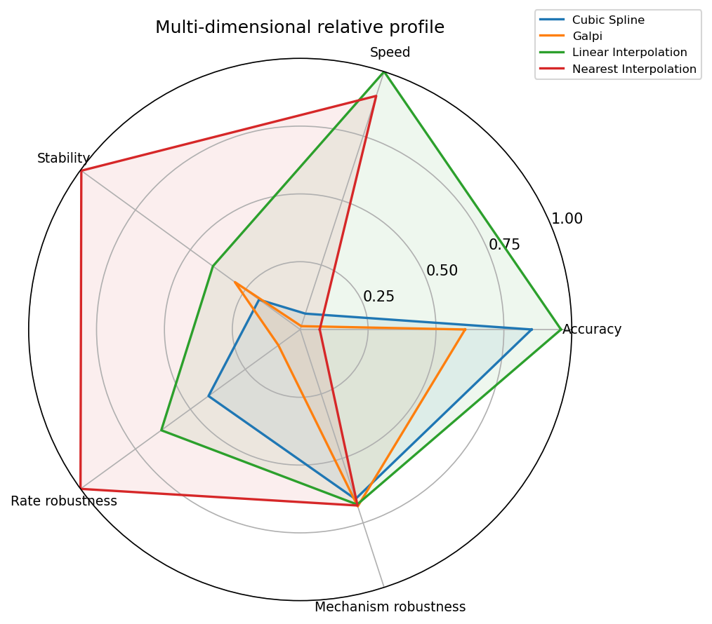

*Relative multi-dimensional profile over the balanced cohort intersection (policy human_multidimensional_relative_v1). Each axis is a relative score in [0,1]; missing dimensions are omitted, never zero.*
