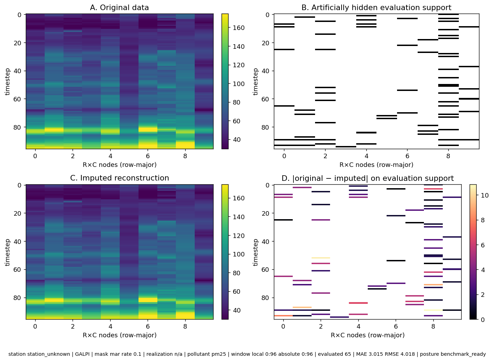

Figure 0.23: Reconstruction storyboard for station full_grid, galpi under MAR 10% missingness, execute realization r006. The panels show the original signal, the artificially hidden evaluation support, the reconstructed signal, and the absolute error restricted to evaluated cells.

**Evidence context.** Station: station_unknown. Dataset: c1b03ed1-dad4-444b-a06d-e85cb81378b6. Evaluated cells: 65. Benchmark contract: attached. Support parity: verified.

**Interpretation boundary.** This bounded visualization illustrates one deterministic window and does not replace aggregate benchmark metrics.
