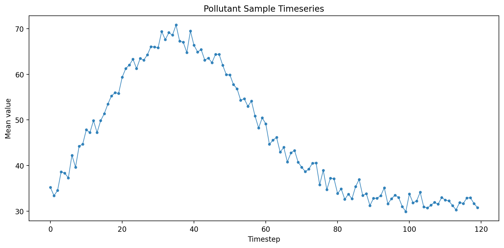

<!-- NAV:START -->
> [🏠 Home](../../../../README.md) · 📍 **README**

<details>
<summary>🗺️ Documentation Map</summary>

- [📂 README](../../../../README.md)
- 📚 **docs/**
  - [🏗️ Architecture_Overview](../../../Architecture_Overview.md)
  - [🔍 Audit_Guide](../../../Audit_Guide.md)
  - [⚙️ Canonical_Workflow](../../../Canonical_Workflow.md)
  - [💻 CLI_Reference](../../../CLI_Reference.md)
  - [🔧 Experiment_Helpers](../../../Experiment_Helpers.md)
  - [⚙️ Experiment_Runs_Benchmark_Contract_Workflow](../../../Experiment_Runs_Benchmark_Contract_Workflow.md)
  - [⚙️ Experiment_Runs_Classical_Workflow](../../../Experiment_Runs_Classical_Workflow.md)
  - [⚙️ Experiment_Runs_DL_Workflow](../../../Experiment_Runs_DL_Workflow.md)
  - [📖 Introduction](../../../Introduction.md)
  - [💻 Migration_Guide_CLI_First_Temporal](../../../Migration_Guide_CLI_First_Temporal.md)
  - [🏷️ Operational_Labels](../../../Operational_Labels.md)
  - [💻 ST_Experiment_CLI_Documentation_Update_Report](../../../ST_Experiment_CLI_Documentation_Update_Report.md)
  - [💻 ST_Experiment_CLI_Philosophy](../../../ST_Experiment_CLI_Philosophy.md)
  - [💻 Study_CLI](../../../Study_CLI.md)
  - [💻 Temporal_Experiment_CLI_Philosophy](../../../Temporal_Experiment_CLI_Philosophy.md)
  - [💻 Temporal_Experiment_CLI_Reference](../../../Temporal_Experiment_CLI_Reference.md)
  - [📝 Temporal_Experiment_Orchestration_Update_Report](../../../Temporal_Experiment_Orchestration_Update_Report.md)
  - [⚙️ Thesis_Workflow](../../../Thesis_Workflow.md)
  - 🤖 **algorithm_design/**
    - [📂 README](../../../algorithm_design/README.md)
    - [📝 arma_imputer](../../../algorithm_design/arma_imputer.md)
    - [🔍 audit_details](../../../algorithm_design/audit_details.md)
    - [📋 regeneration_checklist](../../../algorithm_design/regeneration_checklist.md)
    - 👁️ **supervisor/**
      - [📂 README](../../../algorithm_design/supervisor/README.md)
      - [🏗️ overview](../../../algorithm_design/supervisor/overview.md)
      - [🤖 saits_lc_lch_rationale](../../../algorithm_design/supervisor/saits_lc_lch_rationale.md)
      - [📝 summary_table](../../../algorithm_design/supervisor/summary_table.md)
  - 🛠️ **assets/**
    - 🛠️ **utils/**
      - [📝 Procedure_Standard_GitHub_Connector](../../../assets/utils/Procedure_Standard_GitHub_Connector.md)
      - 🔬 **experiments/**
        - [📂 README](../../../assets/utils/experiments/README.md)
        - [🤖 CLI_LIFECYCLE_SMOKE](../../../assets/utils/experiments/CLI_LIFECYCLE_SMOKE.md)
        - [💻 CLI_PREPARATION_GUIDE](../../../assets/utils/experiments/CLI_PREPARATION_GUIDE.md)
        - [📊 COMPARISON_READINESS](../../../assets/utils/experiments/COMPARISON_READINESS.md)
        - [📝 INDEX](../../../assets/utils/experiments/INDEX.md)
        - [📝 NAMING_CONVENTIONS](../../../assets/utils/experiments/NAMING_CONVENTIONS.md)
        - [⚙️ OFFICIAL_PREPARATION_WORKFLOW](../../../assets/utils/experiments/OFFICIAL_PREPARATION_WORKFLOW.md)
        - 📁 **evidence/**
          - [📝 ARTIFACT_REQUIREMENTS](../../../assets/utils/experiments/evidence/ARTIFACT_REQUIREMENTS.md)
          - [🔍 EVIDENCE_REQUIREMENTS](../../../assets/utils/experiments/evidence/EVIDENCE_REQUIREMENTS.md)
          - [🔍 THESIS_EVIDENCE_MAP](../../../assets/utils/experiments/evidence/THESIS_EVIDENCE_MAP.md)
          - [🔍 TRAINING_SELECTION_EVIDENCE](../../../assets/utils/experiments/evidence/TRAINING_SELECTION_EVIDENCE.md)
        - 🔬 **future_lanes/**
          - [📂 README](../../../assets/utils/experiments/future_lanes/README.md)
          - [📝 SPATIOTEMPORAL_EXTENSION_PLACEHOLDER](../../../assets/utils/experiments/future_lanes/SPATIOTEMPORAL_EXTENSION_PLACEHOLDER.md)
          - [📝 TEMPORAL_CLASSICAL_BASELINES_PLACEHOLDER](../../../assets/utils/experiments/future_lanes/TEMPORAL_CLASSICAL_BASELINES_PLACEHOLDER.md)
          - [📝 TEMPORAL_DL_ABLATIONS_PLACEHOLDER](../../../assets/utils/experiments/future_lanes/TEMPORAL_DL_ABLATIONS_PLACEHOLDER.md)
        - 🔬 **lane1_temporal_londonaq/**
          - [📂 README](../../../assets/utils/experiments/lane1_temporal_londonaq/README.md)
          - [💻 CLI_RUNBOOK](../../../assets/utils/experiments/lane1_temporal_londonaq/CLI_RUNBOOK.md)
          - [📊 COMPARISON_PLAN](../../../assets/utils/experiments/lane1_temporal_londonaq/COMPARISON_PLAN.md)
          - [📝 DL_Benchmark_LondonAQ_MAR](../../../assets/utils/experiments/lane1_temporal_londonaq/DL_Benchmark_LondonAQ_MAR.md)
          - [📝 DL_Benchmark_LondonAQ_MCAR](../../../assets/utils/experiments/lane1_temporal_londonaq/DL_Benchmark_LondonAQ_MCAR.md)
          - [📝 DL_Benchmark_LondonAQ_MNAR](../../../assets/utils/experiments/lane1_temporal_londonaq/DL_Benchmark_LondonAQ_MNAR.md)
          - [⚙️ EXECUTION_ORDER](../../../assets/utils/experiments/lane1_temporal_londonaq/EXECUTION_ORDER.md)
          - [📝 EXPECTED_OBJECTS](../../../assets/utils/experiments/lane1_temporal_londonaq/EXPECTED_OBJECTS.md)
          - [📝 EXPORT_AND_REPORTING_NOTES](../../../assets/utils/experiments/lane1_temporal_londonaq/EXPORT_AND_REPORTING_NOTES.md)
          - [📝 OFFICIAL_DL_BENCHMARK_GRID](../../../assets/utils/experiments/lane1_temporal_londonaq/OFFICIAL_DL_BENCHMARK_GRID.md)
          - [📋 PREPARATION_CHECKLIST](../../../assets/utils/experiments/lane1_temporal_londonaq/PREPARATION_CHECKLIST.md)
          - [📝 TEMPORAL_EXPERIMENT_LANE](../../../assets/utils/experiments/lane1_temporal_londonaq/TEMPORAL_EXPERIMENT_LANE.md)
        - 🔬 **lane1_temporal_londonaq_classical/**
          - [📂 README](../../../assets/utils/experiments/lane1_temporal_londonaq_classical/README.md)
          - [📊 COMPARISON_PLAN](../../../assets/utils/experiments/lane1_temporal_londonaq_classical/COMPARISON_PLAN.md)
          - [⚙️ EXECUTION_ORDER](../../../assets/utils/experiments/lane1_temporal_londonaq_classical/EXECUTION_ORDER.md)
          - [📝 OFFICIAL_CLASSICAL_BENCHMARK_GRID](../../../assets/utils/experiments/lane1_temporal_londonaq_classical/OFFICIAL_CLASSICAL_BENCHMARK_GRID.md)
        - 🔬 **lane2_spatiotemporal_londonaq/**
          - [📂 README](../../../assets/utils/experiments/lane2_spatiotemporal_londonaq/README.md)
          - [🤖 ALGORITHM_IMPLEMENTATION_AUDIT](../../../assets/utils/experiments/lane2_spatiotemporal_londonaq/ALGORITHM_IMPLEMENTATION_AUDIT.md)
          - [📊 EXECUTION_AND_COMPARISON_PLAN](../../../assets/utils/experiments/lane2_spatiotemporal_londonaq/EXECUTION_AND_COMPARISON_PLAN.md)
          - [📝 EXPECTED_OBJECTS](../../../assets/utils/experiments/lane2_spatiotemporal_londonaq/EXPECTED_OBJECTS.md)
          - [📝 GRAPH_CONSTRUCTION_POLICY](../../../assets/utils/experiments/lane2_spatiotemporal_londonaq/GRAPH_CONSTRUCTION_POLICY.md)
          - [📝 INDEX_UPDATE_SNIPPET](../../../assets/utils/experiments/lane2_spatiotemporal_londonaq/INDEX_UPDATE_SNIPPET.md)
          - [📝 MODEL_SELECTION_RATIONALE](../../../assets/utils/experiments/lane2_spatiotemporal_londonaq/MODEL_SELECTION_RATIONALE.md)
          - [📝 OFFICIAL_ST_BENCHMARK_GRID](../../../assets/utils/experiments/lane2_spatiotemporal_londonaq/OFFICIAL_ST_BENCHMARK_GRID.md)
          - [📋 PREPARATION_CHECKLIST](../../../assets/utils/experiments/lane2_spatiotemporal_londonaq/PREPARATION_CHECKLIST.md)
          - [💻 REFERENCES](../../../assets/utils/experiments/lane2_spatiotemporal_londonaq/REFERENCES.md)
          - [📉 SPATIAL_MISSINGNESS_PROTOCOL](../../../assets/utils/experiments/lane2_spatiotemporal_londonaq/SPATIAL_MISSINGNESS_PROTOCOL.md)
          - [💻 ST_LANE_CLI_RUNBOOK](../../../assets/utils/experiments/lane2_spatiotemporal_londonaq/ST_LANE_CLI_RUNBOOK.md)
          - 📁 **recipes/**
            - [📂 README](../../../assets/utils/experiments/lane2_spatiotemporal_londonaq/recipes/README.md)
      - 📁 **studies/**
        - [📂 README](../../../assets/utils/studies/README.md)
  - 🧪 **dev/**
    - [📝 Object_Hierarchy_Map](../../../dev/Object_Hierarchy_Map.md)
    - 🏗️ **architecture_rebase/**
      - [📝 FT00_LEGACY_EXCEPTIONS](../../../dev/architecture_rebase/FT00_LEGACY_EXCEPTIONS.md)
      - [💻 FT04_COMMAND_PARITY_MATRIX](../../../dev/architecture_rebase/FT04_COMMAND_PARITY_MATRIX.md)
      - 🤖 **algorithm_design/**
        - [📝 lab_start](../../../dev/architecture_rebase/algorithm_design/lab_start.md)
    - 🧪 **diagnostic/**
      - [🔍 AUDIT_training_diagnosis_summary](../../../dev/diagnostic/AUDIT_training_diagnosis_summary.md)
      - 📁 **data/**
        - [🧪 training_diagnosis_summary](../../../dev/diagnostic/data/training_diagnosis_summary.md)
      - 🖼️ **figures/**
        - [🧪 TRAINING_GUIDE](../../../dev/diagnostic/figures/TRAINING_GUIDE.md)
  - 📄 **exports/**
    - 📄 **thesis/**
      - 📄 **chapter04/**
        - 📂 **README** ← *you are here*
        - 🔍 **00_audit_snapshot/**
          - [🤖 ad0_design_inventory](00_audit_snapshot/ad0_design_inventory.md)
          - [🤖 ad15_conformance](00_audit_snapshot/ad15_conformance.md)
          - [🤖 ad1_algorithm_cards](00_audit_snapshot/ad1_algorithm_cards.md)
          - [⚙️ ad2_execution_truth](00_audit_snapshot/ad2_execution_truth.md)
          - [📝 lc1_masking_truth](00_audit_snapshot/lc1_masking_truth.md)
        - 📉 **01_dataset_characterization/**
          - 🖼️ **figures/**
            - [📉 DATASET_GUIDE](01_dataset_characterization/figures/DATASET_GUIDE.md)
        - 📉 **02_missingness_characterization/**
          - 🖼️ **figures/**
            - [📋 MISSNESS_GUIDE](02_missingness_characterization/figures/MISSNESS_GUIDE.md)
        - 🤖 **03_algorithm_lifecycle/**
          - [🤖 DL_LIFECYCLE_NARRATIVE(Diagnostic)](03_algorithm_lifecycle/DL_LIFECYCLE_NARRATIVE(Diagnostic).md)
          - 🖼️ **figures/**
            - [🧪 TRAINING_GUIDE](03_algorithm_lifecycle/figures/TRAINING_GUIDE.md)
          - 📎 **sidecars/**
            - [🧪 training_diagnosis_summary](03_algorithm_lifecycle/sidecars/training_diagnosis_summary.md)
          - 📊 **tables/**
            - [🤖 algorithm_evidence_status_table](03_algorithm_lifecycle/tables/algorithm_evidence_status_table.md)
            - [🧪 diagnostic_only_explanation](03_algorithm_lifecycle/tables/diagnostic_only_explanation.md)
        - 📊 **04_comparisons/**
          - [📂 README](04_comparisons/README.md)
          - 📁 **baselines/**
            - [📂 README](04_comparisons/baselines/README.md)
            - 🖼️ **figures/**
              - [📊 COMPARISON_GUIDE](04_comparisons/baselines/figures/COMPARISON_GUIDE.md)
          - 📁 **baselines_and_dl/**
            - [📂 README](04_comparisons/baselines_and_dl/README.md)
            - 🖼️ **figures/**
              - [📊 COMPARISON_GUIDE](04_comparisons/baselines_and_dl/figures/COMPARISON_GUIDE.md)
          - 📁 **dl_temporal/**
            - [📂 README](04_comparisons/dl_temporal/README.md)
            - 🖼️ **figures/**
              - [📊 COMPARISON_GUIDE](04_comparisons/dl_temporal/figures/COMPARISON_GUIDE.md)
          - 🖼️ **figures/**
            - [📊 COMPARISON_GUIDE](04_comparisons/figures/COMPARISON_GUIDE.md)
      - 📄 **chapter06/**
        - [📂 README](../chapter06/README.md)
        - 📁 **00_st_recipe_book/**
          - [📊 ST_RECIPE_BOOK_READINESS](../chapter06/00_st_recipe_book/ST_RECIPE_BOOK_READINESS.md)
          - [📝 ST_RECIPE_MATERIALIZATION_REPORT](../chapter06/00_st_recipe_book/ST_RECIPE_MATERIALIZATION_REPORT.md)
          - [📝 ST_RUN00_PHASE_A_FIX01_BLOCKER_CLOSURE_REPORT](../chapter06/00_st_recipe_book/ST_RUN00_PHASE_A_FIX01_BLOCKER_CLOSURE_REPORT.md)
          - [📝 ST_RUN00_PHASE_A_PREFLIGHT_REPORT](../chapter06/00_st_recipe_book/ST_RUN00_PHASE_A_PREFLIGHT_REPORT.md)
          - [📝 ST_RUN00_PHASE_B_CALIBRATION_REPORT](../chapter06/00_st_recipe_book/ST_RUN00_PHASE_B_CALIBRATION_REPORT.md)
          - [🔍 ST_RUN00_PHASE_B_FIX01_EVIDENCE_CLOSURE_REPORT](../chapter06/00_st_recipe_book/ST_RUN00_PHASE_B_FIX01_EVIDENCE_CLOSURE_REPORT.md)
          - [📝 ST_RUN00_PHASE_B_FIX02_VALIDATION_CONVERGENCE_CLOSURE_REPORT](../chapter06/00_st_recipe_book/ST_RUN00_PHASE_B_FIX02_VALIDATION_CONVERGENCE_CLOSURE_REPORT.md)
          - [⚙️ ST_RUN00_PHASE_C_FIX01_CANONICAL_REPORT_ALIGNMENT](../chapter06/00_st_recipe_book/ST_RUN00_PHASE_C_FIX01_CANONICAL_REPORT_ALIGNMENT.md)
          - [🔍 ST_RUN00_PHASE_C_FIX02_OFFICIAL_CAMPAIGN_STATUS_SEMANTICS](../chapter06/00_st_recipe_book/ST_RUN00_PHASE_C_FIX02_OFFICIAL_CAMPAIGN_STATUS_SEMANTICS.md)
          - [📋 ST_RUN00_PHASE_C_LAUNCH_PREPARATION_REPORT](../chapter06/00_st_recipe_book/ST_RUN00_PHASE_C_LAUNCH_PREPARATION_REPORT.md)
          - [📝 ST_RUN00_PHASE_C_TIER_A_OFFICIAL_REPORT](../chapter06/00_st_recipe_book/ST_RUN00_PHASE_C_TIER_A_OFFICIAL_REPORT.md)
        - 📁 **01_graph_characterization/**
          - [📝 adjacency_summary_table](../chapter06/01_graph_characterization/adjacency_summary_table.md)
          - [📝 graph_policy_table](../chapter06/01_graph_characterization/graph_policy_table.md)
          - [📝 node_mapping_table](../chapter06/01_graph_characterization/node_mapping_table.md)
        - 📉 **02_spatial_missingness_characterization/**
          - [📝 mask_bank_summary_table](../chapter06/02_spatial_missingness_characterization/mask_bank_summary_table.md)
          - [📉 spatial_missingness_mechanism_table](../chapter06/02_spatial_missingness_characterization/spatial_missingness_mechanism_table.md)
          - [📝 target_vs_realized_table](../chapter06/02_spatial_missingness_characterization/target_vs_realized_table.md)
        - 🤖 **03_st_algorithm_lifecycle/**
          - [🤖 algorithm_card_summary](../chapter06/03_st_algorithm_lifecycle/algorithm_card_summary.md)
          - [🤖 st_algorithm_lifecycle_summary](../chapter06/03_st_algorithm_lifecycle/st_algorithm_lifecycle_summary.md)
        - 📊 **04_st_comparisons/**
          - [📝 graph_policy_sensitivity_table](../chapter06/04_st_comparisons/graph_policy_sensitivity_table.md)
          - [📊 spatial_stress_comparison](../chapter06/04_st_comparisons/spatial_stress_comparison.md)
          - [📝 temporal_vs_st_aligned_support_table](../chapter06/04_st_comparisons/temporal_vs_st_aligned_support_table.md)
          - [📝 within_st_all_valid_groups_ranking](../chapter06/04_st_comparisons/within_st_all_valid_groups_ranking.md)
          - [📝 within_st_tier_a_grid4n_ranking](../chapter06/04_st_comparisons/within_st_tier_a_grid4n_ranking.md)
        - 📁 **06_st_gates/**
          - [🤖 algorithm_card_readiness_report](../chapter06/06_st_gates/algorithm_card_readiness_report.md)
          - [📝 artifact_completeness_report](../chapter06/06_st_gates/artifact_completeness_report.md)
          - [📝 convergence_report](../chapter06/06_st_gates/convergence_report.md)
          - [📊 gate_report_comparison_ready](../chapter06/06_st_gates/gate_report_comparison_ready.md)
          - [🧪 gate_report_scientific_training_ready](../chapter06/06_st_gates/gate_report_scientific_training_ready.md)
          - [📄 gate_report_thesis_ready](../chapter06/06_st_gates/gate_report_thesis_ready.md)
          - [📝 gate_report_train_only_correlation_graph_ready](../chapter06/06_st_gates/gate_report_train_only_correlation_graph_ready.md)
          - [🔍 scientific_evidence_export_ready_report](../chapter06/06_st_gates/scientific_evidence_export_ready_report.md)
          - [📝 train_only_correlation_graph_report](../chapter06/06_st_gates/train_only_correlation_graph_report.md)
          - [🧪 training_adequacy_report](../chapter06/06_st_gates/training_adequacy_report.md)
        - 🖼️ **07_figures/**
          - [📂 README](../chapter06/07_figures/README.md)
          - 📁 **A_training_dynamics/**
            - [📂 README](../chapter06/07_figures/A_training_dynamics/README.md)
          - 📁 **B_performance_distribution/**
            - [📂 README](../chapter06/07_figures/B_performance_distribution/README.md)
          - 📁 **C_realization_stability/**
            - [📂 README](../chapter06/07_figures/C_realization_stability/README.md)
          - 📁 **D_runtime_efficiency/**
            - [📂 README](../chapter06/07_figures/D_runtime_efficiency/README.md)
          - 📁 **E_scientific_evidence/**
            - [📂 README](../chapter06/07_figures/E_scientific_evidence/README.md)
        - 📁 **07_graph_policy_sensitivity/**
          - [📂 README](../chapter06/07_graph_policy_sensitivity/README.md)
          - [📝 GRAPH_POLICY_SENSITIVITY_BLOCKERS](../chapter06/07_graph_policy_sensitivity/GRAPH_POLICY_SENSITIVITY_BLOCKERS.md)
          - [📝 GRAPH_POLICY_SENSITIVITY_REPORT](../chapter06/07_graph_policy_sensitivity/GRAPH_POLICY_SENSITIVITY_REPORT.md)
        - 📁 **08_scientific_evidence_profile/**
          - [📂 README](../chapter06/08_scientific_evidence_profile/README.md)
          - [📝 SCIENTIFIC_BLOCKERS](../chapter06/08_scientific_evidence_profile/SCIENTIFIC_BLOCKERS.md)
          - [📝 SCIENTIFIC_CLAIM_MATRIX](../chapter06/08_scientific_evidence_profile/SCIENTIFIC_CLAIM_MATRIX.md)
          - [🔍 SCIENTIFIC_EVIDENCE_PROFILE](../chapter06/08_scientific_evidence_profile/SCIENTIFIC_EVIDENCE_PROFILE.md)
        - 📁 **09_scientific_gate/**
          - [📂 README](../chapter06/09_scientific_gate/README.md)
          - [📝 SCIENTIFIC_GATE_BLOCKERS](../chapter06/09_scientific_gate/SCIENTIFIC_GATE_BLOCKERS.md)
          - [📝 SCIENTIFIC_GATE_REPORT](../chapter06/09_scientific_gate/SCIENTIFIC_GATE_REPORT.md)

</details>
<!-- NAV:END -->

# Air-Quality Imputation Evidence Pack

This folder contains a structured evidence pack for an air-quality imputation benchmark produced with **EviBench / ImputeBench**.

The pack is organized so that a reader can move from dataset characterization to missingness protocols, algorithm lifecycle evidence, comparisons, storyboards, gates, and UI traceability.

```text
chapter04/
├── CHAPTER04_EVIDENCE_MANIFEST.json
├── 00_audit_snapshot/
├── 01_dataset_characterization/
├── 02_missingness_characterization/
├── 03_algorithm_lifecycle/
├── 04_comparisons/
├── 05_storyboards/
├── 06_gates/
└── 07_ui_screenshots/
```

---

## 1. Audit snapshot

Path:

```text
00_audit_snapshot/
```

This pack stores audit files used to document design inventory, conformance, execution truth, masking truth, and snapshot manifest state.

Representative files:

- [`ad0_design_inventory.md`](00_audit_snapshot/ad0_design_inventory.md)
- [`ad15_conformance.md`](00_audit_snapshot/ad15_conformance.md)
- [`ad1_algorithm_cards.md`](00_audit_snapshot/ad1_algorithm_cards.md)
- [`ad2_execution_truth.md`](00_audit_snapshot/ad2_execution_truth.md)
- [`lc1_masking_truth.md`](00_audit_snapshot/lc1_masking_truth.md)

---

## 2. Dataset characterization

Path:

```text
01_dataset_characterization/
├── figures/
└── sidecars/
```

<p align="center">
  
</p>

<p align="center">
  
</p>

Main figures:

- [`dataset_summary_table.png`](01_dataset_characterization/figures/dataset_summary_table.png)
- [`pollutant_distribution_panel.png`](01_dataset_characterization/figures/pollutant_distribution_panel.png)
- [`pollutant_sample_timeseries.png`](01_dataset_characterization/figures/pollutant_sample_timeseries.png)
- [`spatial_grid_snapshot.png`](01_dataset_characterization/figures/spatial_grid_snapshot.png)
- [`temporal_coverage_strip.png`](01_dataset_characterization/figures/temporal_coverage_strip.png)

Guide:

- [`DATASET_GUIDE.md`](01_dataset_characterization/figures/DATASET_GUIDE.md)

---

## 3. Missingness characterization

Path:

```text
02_missingness_characterization/
├── figures/
└── sidecars/
```

<p align="center">
  
</p>

<p align="center">
  
</p>

Main guide:

- [`MISSNESS_GUIDE.md`](02_missingness_characterization/figures/MISSNESS_GUIDE.md)

Representative figures:

- [`missingness_mechanism_table_mcar_0p3_test.png`](02_missingness_characterization/figures/London-AQ-Synthetic_fa9c7108/missingness_mechanism_table_mcar_0p3_test.png)
- [`mask_realization_grid_mcar_0p3_test_r000.png`](02_missingness_characterization/figures/London-AQ-Synthetic_fa9c7108/mask_realization_grid_mcar_0p3_test_r000.png)
- [`mask_realization_grid_mar_0p3_test_r000.png`](02_missingness_characterization/figures/London-AQ-Synthetic_fa9c7108/mask_realization_grid_mar_0p3_test_r000.png)
- [`mask_realization_grid_mnar_0p3_test_r000.png`](02_missingness_characterization/figures/London-AQ-Synthetic_fa9c7108/mask_realization_grid_mnar_0p3_test_r000.png)
- [`realized_rate_distribution_mcar_0p3_test.png`](02_missingness_characterization/figures/London-AQ-Synthetic_fa9c7108/realized_rate_distribution_mcar_0p3_test.png)

---

## 4. Algorithm lifecycle — official benchmark evidence

Path:

```text
03_algorithm_lifecycle/
├── figures/            ← training curves, convergence, stability (official runs)
├── sidecars/           ← training_diagnosis_summary.{csv,json,md} (official runs)
├── tables/             ← algorithm_evidence_status_table, diagnostic_only_explanation
└── training_evidence/  ← per-algo checkpoint_selection, runtime_summary, training_history (official runs)
```

These artifacts come from **official benchmark runs** (with benchmark contracts, all missingness conditions). They are the primary evidence tier for Section 4.3 of the thesis.

Training lifecycle figures:

<p align="center">
  
</p>

<p align="center">
  
</p>

- [`training_curves.png`](03_algorithm_lifecycle/figures/training_curves.png)
- [`validation_performance.png`](03_algorithm_lifecycle/figures/validation_performance.png)
- [`best_epoch_distribution.png`](03_algorithm_lifecycle/figures/best_epoch_distribution.png)
- [`convergence_speed.png`](03_algorithm_lifecycle/figures/convergence_speed.png)
- [`training_stability.png`](03_algorithm_lifecycle/figures/training_stability.png)

Guides and tables:

- [`TRAINING_GUIDE.md`](03_algorithm_lifecycle/figures/TRAINING_GUIDE.md)
- [`training_diagnosis_summary.md`](03_algorithm_lifecycle/sidecars/training_diagnosis_summary.md) — official benchmark sidecar
- [`algorithm_evidence_status_table.md`](03_algorithm_lifecycle/tables/algorithm_evidence_status_table.md)
- [`diagnostic_only_explanation.md`](03_algorithm_lifecycle/tables/diagnostic_only_explanation.md)

---

## 4b. Diagnostic lane evidence — lifecycle conformance only

> ⚠️ **Scope boundary.** This section contains *diagnostic-lane* evidence. It is distinct from the official benchmark evidence above. It establishes **lifecycle conformance** (train → validation → test documented, no pathological state) for BRITS, SAITS, SAITS-LC, GRU-D under MCAR 30%. It does **not** constitute benchmark performance evidence and must not be cited as a final ranking.

> **Evidence status (2026-05-11):** Diagnostic sweep complete — 32 plans, 4 algorithms, MCAR 30%, LondonAQ. Official benchmark-grade DL runs (with benchmark contracts) are the next pending tier.

Path:

```text
03_algorithm_lifecycle/
└── diagnostic_comparisons/   ← diagnostic sidecar, RMSE comparison table and figure
```

Lifecycle conformance narrative:

- [`CHAPTER04_DL_LIFECYCLE_NARRATIVE.md`](03_algorithm_lifecycle/DL_LIFECYCLE_NARRATIVE(Diagnostic).md) — 11-section narrative; diagnostic-only scope throughout

Diagnostic orientation — algorithm behavior under MCAR 30%:

<p align="center">
  
</p>

- `diagnostic_comparison_table.md`
- `diagnostic_lane_sidecar.csv` — 32-row normative source
- `diagnostic_lane_sidecar.md`

---

## 5. Comparison evidence

Path:

```text
04_comparisons/
├── baselines/
├── baselines_and_dl/
├── dl_temporal/
└── per_spec/
```

The comparison evidence is split into three lots.

| Lot | Purpose | Folder |
|---|---|---|
| `baselines` | Classical + naive baselines | [`baselines/`](04_comparisons/baselines/) |
| `dl_temporal` | Temporal deep-learning methods | [`dl_temporal/`](04_comparisons/dl_temporal/) |
| `baselines_and_dl` | Cross-family comparison | [`baselines_and_dl/`](04_comparisons/baselines_and_dl/) |

<p align="center">
  
</p>

<p align="center">
  
</p>

<p align="center">
  
</p>

Each lot contains:

```text
figures/
├── 01_global_ranking.png
├── 02_scenario_comparison.png
├── 03_family_parity.png
├── 04_runtime_vs_rmse.png
├── 05_pollutant_heatmap.png
├── 06_rate_sensitivity.png
├── 07_error_heatmap.png
└── COMPARISON_GUIDE.md
```

---

## 6. Storyboards

Path:

```text
05_storyboards/
```

Storyboards provide structured narrative files for each official comparison context. They are useful for reading comparison results as evidence rather than as isolated charts.

Examples:

- [`DL-Official-Benchmark-Comparison-LondonAQ-MCAR-0.3-test_cd369f92.md`](05_storyboards/DL-Official-Benchmark-Comparison-LondonAQ-MCAR-0.3-test_cd369f92.md)
- [`Classical-Official-Benchmark-Comparison-LondonAQ-MCAR-0.3-test_458a1870.md`](05_storyboards/Classical-Official-Benchmark-Comparison-LondonAQ-MCAR-0.3-test_458a1870.md)

---

## 7. Gates

Path:

```text
06_gates/
├── figures/
└── sidecars/
```

<p align="center">
  
</p>

Main files:

- [`evidence_matrix.png`](06_gates/figures/evidence_matrix.png)
- [`evidence_summary.csv`](06_gates/sidecars/evidence_summary.csv)
- [`reproducib

<!-- FOOTER:START -->

---

> [← TRAINING_GUIDE](../../../dev/diagnostic/figures/TRAINING_GUIDE.md) · [⬆ Top](#) · [🏠 Home](../../../../README.md) · [ad0_design_inventory →](00_audit_snapshot/ad0_design_inventory.md)
<!-- FOOTER:END -->
